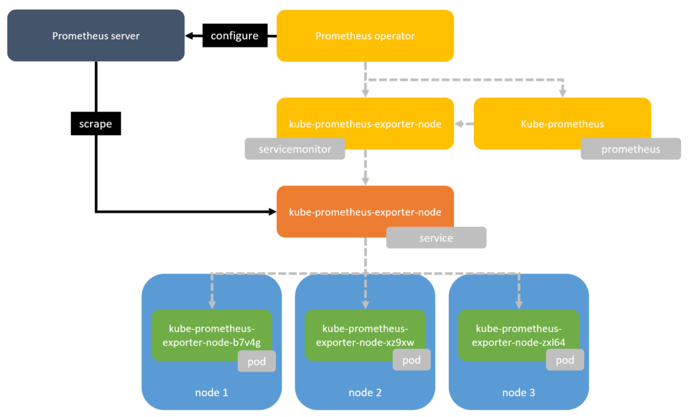

# How to prepare your Kubernetes cluster for monitoring pods deployments.


## Create namespace for monitoring (Prometheus, Grafana)

```console
kubectl create namespace monitoring
```

## Install Prometheus

```console
helm install \
    --namespace=monitoring \
    --name=myprometheus \
    --version=7.0.0 \
    stable/prometheus
```

### Prometheus pod 	

```console
kubectl get pod --namespace monitoring  -l release=myprometheus -l component=server
```

### Port forwarding 

```console
kubectl --namespace monitoring port-forward $(kubectl get pod --namespace monitoring -l release=myprometheus -l component=server -o template --template "{{(index .items 0).metadata.name}}") 9090:9090
```

## Install Grafana

```console
helm install \
    --namespace=default \
    --name=mygrafana \
    --version=1.12.0 \
    --set=adminUser=admin \
    --set=adminPassword=admin \
    #--set=service.type=LoadBalancer \   # if IP should by outside 
	--set=service.type=NodePort \
    stable/grafana 
```
### grafana pod	
```console
kubectl get pod --namespace monitoring  -l release=mygrafana -l app=grafana
```


### Port forwarding 

```console
kubectl --namespace monitoring port-forward $(kubectl get pod --namespace monitoring -l release=mygrafana -l app=grafana -o template --template "{{(index .items 0).metadata.name}}") 3000:3000
```

### If service.type=LoadBalancer was chosen for Grafana run 

```console
kubectl get svc --namespace monitoring  mygrafana
```
to get EXTERNAL-IP and PORT


## Create namespace for application

```console
kubectl create namespace my-app
```

## Creating quotas per application namespace

```console
cat <<EOF > quotas.yaml
apiVersion: v1
kind: ResourceQuota
metadata:
  name: compute-resources
spec:
  hard:
    pods: "20"
    requests.cpu: "2"
    requests.memory: 2Gi
    limits.cpu: "4"
    limits.memory: 4Gi
    requests.nvidia.com/gpu: 4
EOF
```

### applying quotas to namespace

```console
kubectl apply -f ./quotas.yaml --namespace=my-app

```





#### based on https://itnext.io/using-prometheus-in-azure-kubernetes-service-aks-ae22cada8dd9


