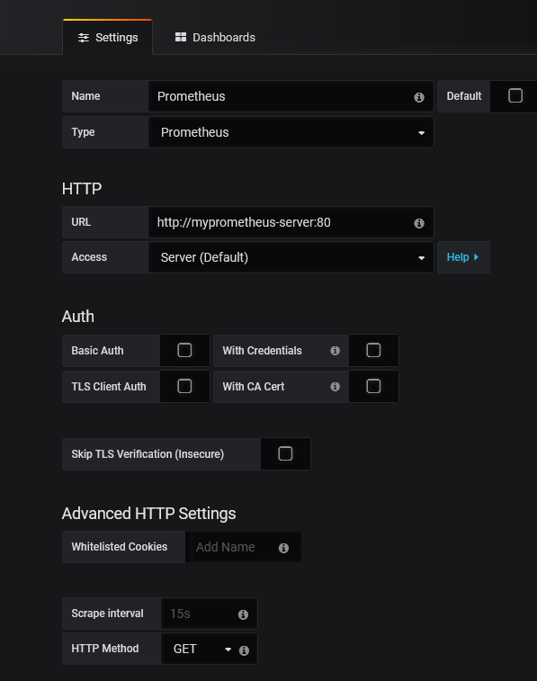
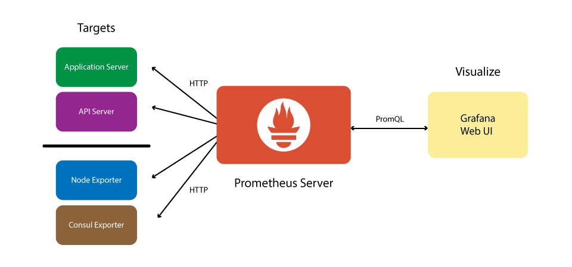

# How to prepare your Kubernetes cluster for monitoring pods deployments.


## Create namespace for monitoring (Prometheus, Grafana)

```console
kubectl create namespace monitoring
```

## Install Prometheus

```console
helm install \
    --namespace=monitoring \
    --name=myprometheus \
    --version=7.0.0 \
    stable/prometheus
```

### Prometheus pod 	

```console
kubectl get pod --namespace monitoring  -l release=myprometheus -l component=server
```

### Port forwarding 

```console
kubectl --namespace monitoring port-forward $(kubectl get pod --namespace monitoring -l release=myprometheus -l component=server -o template --template "{{(index .items 0).metadata.name}}") 9090:9090
```

## Install Grafana

```console
helm install \
    --namespace=monitoring \
    --name=mygrafana \
    --version=1.12.0 \
    --set=adminUser=admin \
    --set=adminPassword=admin \
	  --set=service.type=NodePort \
    stable/grafana 
```

```console
helm install \
    --namespace=grafana \
    --name=mygrafana \
    --version=1.12.0 \
    --set=adminUser=admin \
    --set=adminPassword=admin \
    --set=service.type=LoadBalancer \   # if IP should by outside 
	    stable/grafana 
```

### grafana pod	
```console
kubectl get pod --namespace monitoring  -l release=mygrafana -l app=grafana
```


### Port forwarding 

```console
kubectl --namespace monitoring port-forward $(kubectl get pod --namespace monitoring -l release=mygrafana -l app=grafana -o template --template "{{(index .items 0).metadata.name}}") 3000:3000
```

### If service.type=LoadBalancer was chosen for Grafana run 

```console
kubectl get svc --namespace monitoring  mygrafana
```
to get EXTERNAL-IP and PORT


### Connect grafana to Prometheus

kubectl get svc myprometheus-server --namespace=monitoring





### Ready dashboards for Kubernetes yuo can find there

https://grafana.com/grafana/dashboards?dataSource=prometheus&search=kubernetes


### Prometheus architecture


#### based on https://itnext.io/using-prometheus-in-azure-kubernetes-service-aks-ae22cada8dd9


## Create namespace for application

```console
kubectl create namespace my-app
```

## Creating quotas per application namespace

```console
cat <<EOF > quotas.yaml
apiVersion: v1
kind: ResourceQuota
metadata:
  name: compute-resources
spec:
  hard:
    pods: "20"
    requests.cpu: "2"
    requests.memory: 2Gi
    limits.cpu: "4"
    limits.memory: 4Gi
    requests.nvidia.com/gpu: 4
EOF
```

### applying quotas to namespace

```console
kubectl apply -f ./quotas.yaml --namespace=my-app

```

Prometheus is an open-source and one of the popular CNCF projects written in Golang. 
Some of its components are written in Ruby but most of the components are written in Go. 
This means you have a single binary executables. 
You download and run Prometheus with its components; it's that simple. 
Prometheus is fully Docker compatible, and a number of Prometheus components within Prometheus itself are available on the Docker Hub.


Promtheus Server

Prometheus has a main central component called Prometheus Server. 
As a monitoring service, Prometheus servers monitor a particular thing. 
That thing could be anything: it could be a an entire Linux server, a stand-alone Apache server, a single process, a database service or some other system unit that you want to monitor. In Prometheus terms, we call the main monitoring service the Prometheus Server and the things that Prometheus monitors are called **Targets**. So the Prometheus server monitors Targets. As said earlier, "Targets" can also refer to an array of things. It could be a single server or a targets for probing of endpoints over HTTP, HTTPS, DNS, TCP and ICMP (*Black-Box Exporter), or it could be a simple HTTP endpoint that an application exposes through which the Prometheus server gets the application's health status from.

Each unit of a target such as current CPU status, memory usage (in case of a Linux server Prometheus Target) or any other specific unit that you would like to monitor is called a **metric**. So Prometheus server collects metrics from targets (over HTTP), stores them locally or remotely and displays them back in the Prometheus server.

The Prometheus server scrapes targets at an interval that you define to collect metrics from specific targets and store them in a time-series database. You define the targets to be scraped and the time-interval for scraping metrics.


You get the metrics details by querying from the Prometheus’s time-series database where the Prometheus stores metrics and you use a query language called PromQL in the Prometheus server to query metrics about the targets. In other words, you ask the Prometheus server via PromQL to show us the status of a particular target at a given time.

Prometheus provides client-libraries in a number of languages that you can use to provide health-status of your application. But Prometheus is not only about application monitoring, you can use something called **Exporters** to monitor third-party systems (Such as a Linux Server, MySQL daemon etc). An Exporter is a piece of software that gets existing metrics from a third-party system and export them to the metric format that the Prometheus server can understand.


Visualization Layer with **Grafana**
You use Grafana, the visualization layer, as the 3rd component to visualize metrics stored in the Prometheus time-series database. Instead of writing PromQL queries directly into the Prometheus server, you use Grafana UI boards to query metrics from Prometheus server and visualize them in the Grafana Dashboard as a whole, as we will see it in action shortly.




