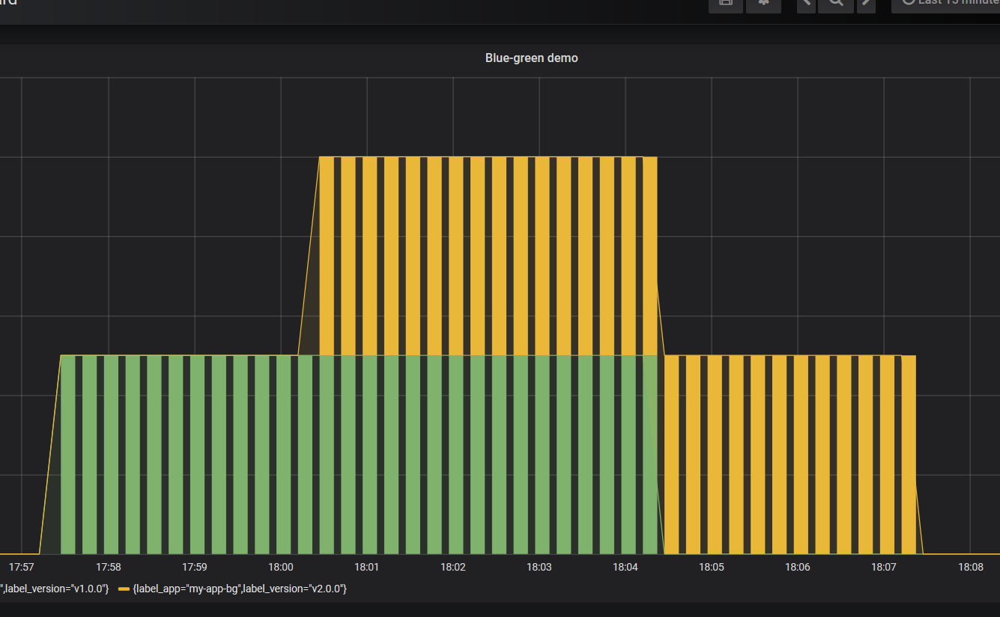

Blue/green deployment to release a single service
=================================================

> In this example, we release a new version of a single service using the
blue/green deployment strategy.



## Steps to follow

1. version 1 is serving traffic
1. deploy version 2
1. wait until version 2 is ready
1. switch incoming traffic from version 1 to version 2
1. shutdown version 1

## In practice

### Deploy the first application

```cosnsole
$ kubectl apply -f app-v1.yaml --name-space=my-app
```

### Test if the deployment was successful
```console
kubectl get all --namespace=my-app
```

### To see the deployment in action, open a new terminal and run the following
### command:

```console
watch kubectl get po  --namespace=my-app
```

### Then deploy version 2 of the application

```console
kubectl apply -f app-v2.yaml --namespace=my-app
```

### Wait for all the version 2 pods to be running

```console
kubectl rollout status deploy my-app-bg-v2 --namespace=my-app
> deployment "my-app-bg-v2" successfully rolled out
```

### Side by side, x pods are running with version 2 but the service still send
### traffic to the first deployment.

If necessary, you can manually test one of the pod by port-forwarding it to
your local environment.

```console
kubectl get services my-app-bg --namespace=my-app

kubectl describe services my-app-bg --namespace=my-app

```
Forward service port to http://localhost:9999
```console
kubectl port-forward service/my-app-bg --namespace=my-app 9999:80
```

Once your are ready, you can switch the traffic to the new version by patching
the service to send traffic to all pods with label version=v2.0.0

```console
kubectl patch service my-app-bg -p '{"spec":{"selector":{"version":"v2.0.0"}}}'
```

### Test if the second deployment was successful

```console
service=http://localhost:9999
while sleep 0.1; do curl "$service"; done
```

### In case you need to rollback to the previous version

```console
kubectl patch service my-app-bg -p '{"spec":{"selector":{"version":"v1.0.0"}}}'
```

You can also check the same inside the temporary pod
```console
kubectl run myubuntu --image ubuntu:16.04 --rm -ti --generator=run-pod/v1
kubectl run myubuntu --image ubuntu:16.04 --rm -ti --generator=deployment/apps.v1
kubectl run myubuntu --image ubuntu:16.04 --rm -ti --generator=run-pod/v1 \
  --requests "cpu=50m,memory=50Mi" --limits="cpu=100m,memory=100Mi"
```
> apt-get update
>
> apt-get install curl
>
> service=http://my-app-bg:80
>
> while sleep 0.1; do curl "$service"; done

### If everything is working as expected, you can then delete the v1.0.0
### deployment

```console
kubectl delete deploy my-app-bg-v1
```

### Cleanup

```console
kubectl delete all -l app=my-app-bg
```


#### Filter in Grafana
```console
sum(kube_pod_labels{label_app="my-app-bg", namespace="my-app"}) by (label_app,label_version)
```