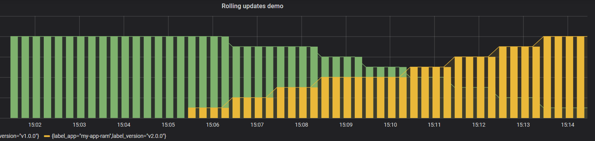

Ramped deployment
=================

> Version B is slowly rolled out and replacing version A. Also known as
rolling-update or incremental.



The ramped deployment strategy consists of slowly rolling out a version of an
application by replacing instances one after the other until all the instances
are rolled out. It usually follows the following process: with a pool of version
A behind a load balancer, one instance of version B is deployed. When the
service is ready to accept traffic, the instance is added to the pool. Then, one
instance of version A is removed from the pool and shut down.

Depending on the system taking care of the ramped deployment, you can tweak the
following parameters to increase the deployment time:

- Parallelism, max batch size: Number of concurrent instances to roll out.
- Max surge: How many instances to add in addition of the current amount.
- Max unavailable: Number of unavailable instances during the rolling update
  procedure.

## Steps to follow

1. version 1 is serving traffic
1. deploy version 2
1. wait until all replicas are replaced with version 2

## In practice

### Deploy the first application

```console
kubectl apply -f app-v1.yaml --namespace=my-app
```

service/my-app created
deployment.apps/my-app-ram created

### Test if the deployment was successful

```console
kubectl get service my-app
```

### To see the deployment in action, open a new terminal and run the following
### command

```console
kubectl get po --namespace=my-app
```

### Then deploy version 2 of the application

```console
kubectl apply -f app-v2.yaml --namespace=my-app
```

### Test the second deployment progress
service=$(minikube service my-app-ram --url)
while sleep 0.1; do curl "$service"; done

### In case you discover some issue with the new version, you can undo the
### rollout
```console
kubectl rollout undo deploy my-app-ram
```


### If you can also pause the rollout if you want to run the application for a
### subset of users

```console
kubectl rollout pause deploy my-app-ram
```

### Then if you are satisfy with the result, rollout

```console
kubectl rollout resume deploy my-app-ram
```

### Cleanup

```bash
kubectl delete all -l app=my-app-ram
```


#### Filter in Grafana

```console
sum(kube_pod_labels{label_app="my-app-ram"}) by (label_app,label_version)
```
