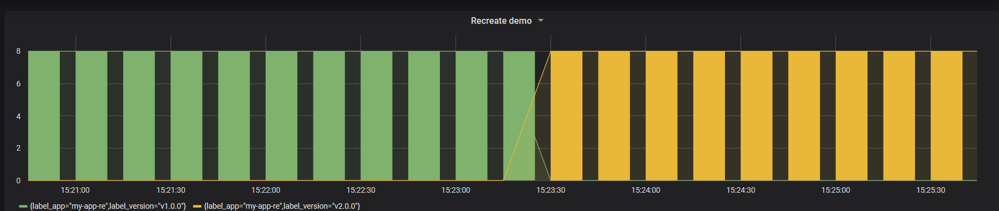

Recreate deployment
===================

> Version A is terminated then version B is rolled out.



## In practice


### Deploy the first application

```console
kubectl apply -f app-v1.yaml --namespace=my-app
```

#### List all pods

```console
kubectl get pods |grep my-app-re
```

### Then deploy version 2 of the application

```console
kubectl apply -f app-v2.yaml --namespace=my-app
```

#### List all pods

```console
kubectl get pods |grep my-app-re
```
#### Delete deployment

```console
kubectl delete deployment/my-app-re --namespace=my-app
```

#### Filter in Grafana

```console
sum(kube_pod_labels{label_app="my-app-re"}) by (label_app,label_version)
```