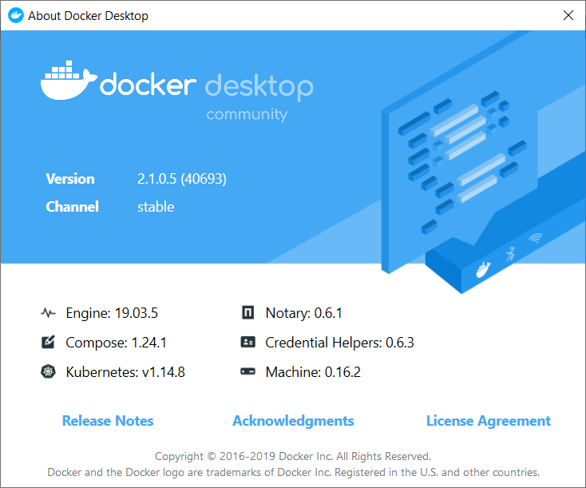
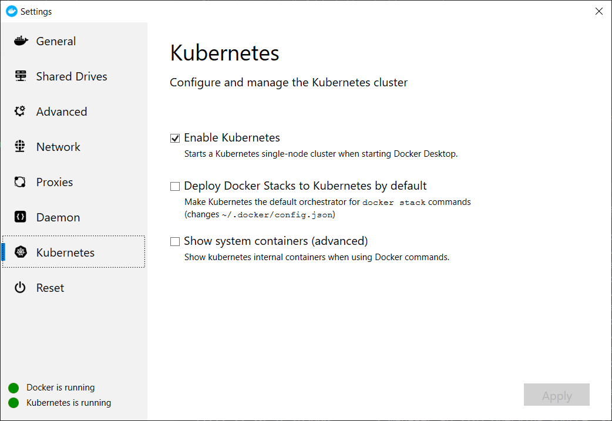
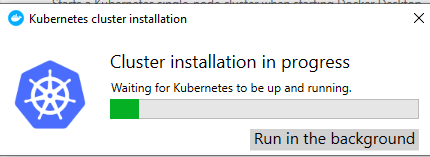
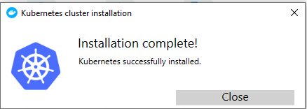
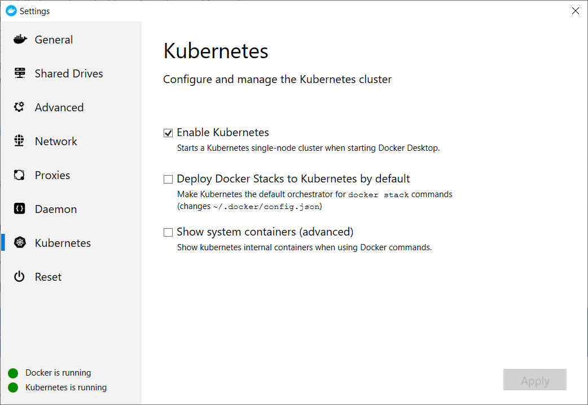
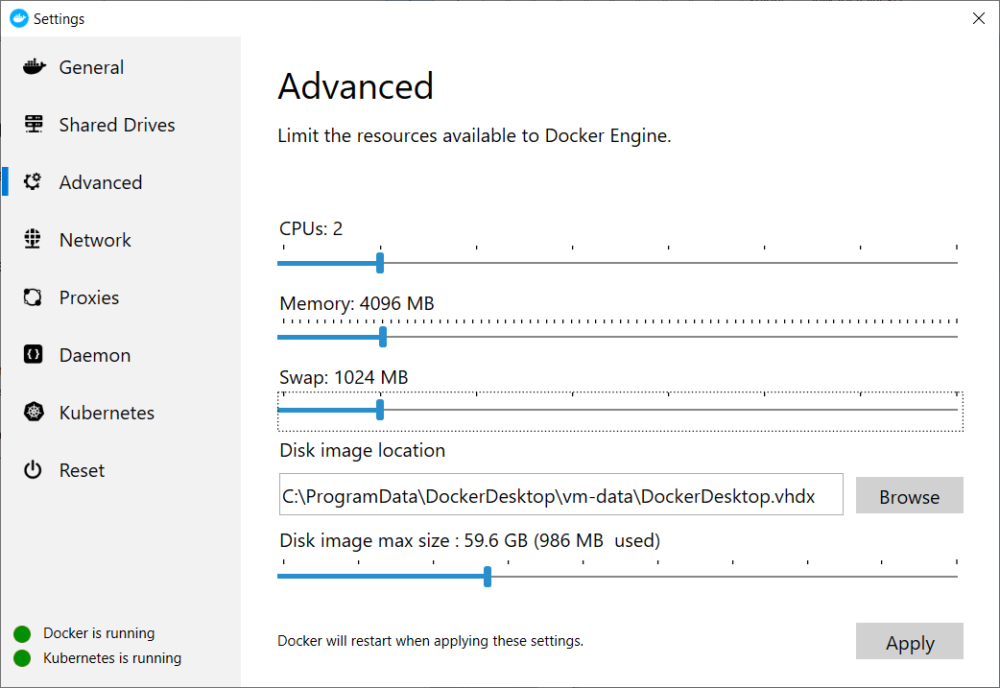
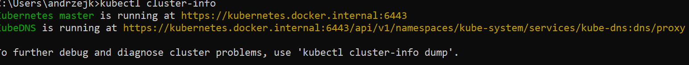
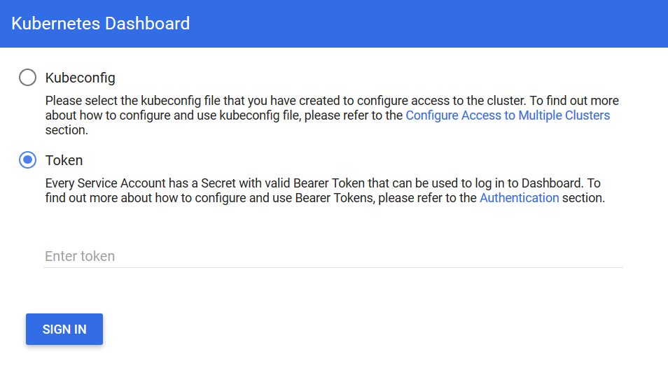
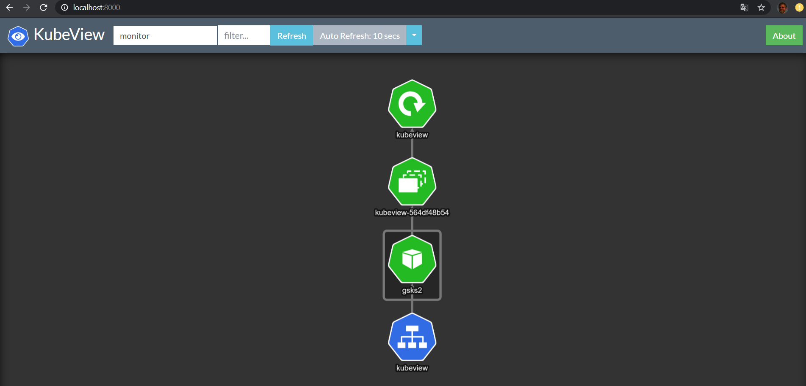

# Using local kubernetes (k8s) cluster in Docker Desktop


## 1. Installing Docker Desktop

Installation files taken from

https://hub.docker.com/editions/community/docker-ce-desktop-windows

After login  to Docker Hub account  and downloading the stable version





## 2. Enabling Kubernetes





The installation process begins



After a while





Adding more memory (here 4GB)




Checking cluster health

```console
kubectl cluster-info
```




For new k8s users: lets try to control the cluster from GUI instead of cli (kubectl)

## 3. Adding dashboard

```console
kubectl apply -f https://raw.githubusercontent.com/kubernetes/dashboard/v1.10.1/src/deploy/recommended/kubernetes-dashboard.yaml
```
<pre>
secret/kubernetes-dashboard-certs configured
serviceaccount/kubernetes-dashboard configured
role.rbac.authorization.k8s.io/kubernetes-dashboard-minimal configured
rolebinding.rbac.authorization.k8s.io/kubernetes-dashboard-minimal configured
deployment.apps/kubernetes-dashboard configured
service/kubernetes-dashboard configured
</pre>

```console
kubectl proxy
```
<pre>
Starting to serve on 127.0.0.1:8001
</pre>

Dashboard is accesible at

http://localhost:8001/api/v1/namespaces/kube-system/services/https:kubernetes-dashboard:/proxy/


Set the token menu




The way to get the token from kubernetes cluster

In Bash
```console
TOKEN=$(kubectl -n kube-system describe secret default | grep 'token:' | awk '{print $2}')
echo $TOKEN
```
<pre>
 ......TOKEN .......
</pre>

Paste the token value


## 4. Adding metrics server


Unfortunately the metrics server is absent

```console
kubectl top nodes
```
<pre>
Error from server (NotFound): the server could not find the requested resource (get services http:heapster:)
</pre>

```console
kubectl top pods
```
<pre>
Error from server (NotFound): the server could not find the requested resource (get services http:heapster:)
</pre>

The final solution with helm

### Using helm 3 do deploy metrics server in Docker Destop

##### Installing helm from
https://github.com/helm/helm/releases

At present  version 3.0.2...

For Windows OS

Extract

https://get.helm.sh/helm-v3.0.2-windows-amd64.zip

and put the binary into 

C:\Program Files\Docker\Docker\resources\bin

```console
helm version
```
<pre>
version.BuildInfo{Version:"v3.0.2", GitCommit:"19e47ee3283ae98139d98460de796c1be1e3975f", GitTreeState:"clean", GoVersion:"go1.13.5"}
</pre>


#### Adding standard repo of helm charts

```console
helm repo add stable https://kubernetes-charts.storage.googleapis.com/
```
<pre>
"stable" has been added to your repositories
</pre>
```console
helm repo list
```
<pre>
NAME    URL
stable  https://kubernetes-charts.storage.googleapis.com/
</pre>


```console
helm install metrics stable/metrics-server  --namespace kube-system --set args={--kubelet-insecure-tls}
```
<pre>
NAME: metrics
LAST DEPLOYED: Tue Dec 24 11:24:27 2019
NAMESPACE: kube-system
STATUS: deployed
REVISION: 1
NOTES:
The metric server has been deployed.

In a few minutes you should be able to list metrics using the following
command:

kubectl get --raw "/apis/metrics.k8s.io/v1beta1/nodes"
</pre>

After few minutes ...... coffe break ?
...
Error from server (ServiceUnavailable): the server is currently unable to handle the request (get nodes.metrics.k8s.io)
...
error: metrics not available yet


```console
kubectl top nodes
```
<pre>
NAME             CPU(cores)   CPU%   MEMORY(bytes)   MEMORY%   
docker-desktop   274m         13%    948Mi           24%
</pre>

```console
kubectl top pods
```
<pre>

</pre>

```console
kubectl top pods --all-namespaces
```
<pre>
NAMESPACE     NAME                                      CPU(cores)   MEMORY(bytes)   
docker        compose-6c67d745f6-9bjbb                  1m           7Mi
docker        compose-api-57ff65b8c7-chtkc              3m           17Mi
kube-system   coredns-6dcc67dcbc-dczwj                  6m           7Mi
kube-system   coredns-6dcc67dcbc-z5mvp                  6m           7Mi
kube-system   etcd-docker-desktop                       32m          27Mi
kube-system   kube-apiserver-docker-desktop             52m          278Mi
kube-system   kube-controller-manager-docker-desktop    31m          42Mi
kube-system   kube-proxy-bwj4l                          4m           8Mi
kube-system   kube-scheduler-docker-desktop             2m           10Mi
kube-system   kubernetes-dashboard-5f7b999d65-vc9rs     1m           14Mi
kube-system   metrics-metrics-server-7665c546b6-7gmzn   3m           11Mi
</pre>


##  5. Adding cluster visualizator (kubeview)  

#### Let's use the kubeview application  in separate namespace (monitor)
```console
kubectl create ns monitor
```
<pre>
namespace/monitor created
</pre>

```console
kubectl apply -f kubeview-deployment.yaml -n monitor

# or directly from github 

kubectl apply -f https://raw.githubusercontent.com/djkormo/k8s-AKS-primer/master/docker/k8s-in-docker-desktop/kubeview-deployment.yaml -n monitor


```
 
<pre>
deployment.extensions/kubeview created
</pre>

```console
kubectl apply -f kubeview-service.yaml -n monitor

# or directly from github 

kubectl apply -f https://raw.githubusercontent.com/djkormo/k8s-AKS-primer/master/docker/k8s-in-docker-desktop/kubeview-service.yaml -n monitor

```
<pre>
service/kubeview created
</pre>
#### Checking our deployment in monitor namespace
```console
kubectl get svc,deploy,rs,po -n monitor
```
<pre>
NAME               TYPE           CLUSTER-IP      EXTERNAL-IP   PORT(S)          AGE
service/kubeview   LoadBalancer   10.98.143.135   localhost     3030:30329/TCP   5s 

NAME                             READY   UP-TO-DATE   AVAILABLE   AGE
deployment.extensions/kubeview   1/1     1            1           10m

NAME                                        DESIRED   CURRENT   READY   AGE
replicaset.extensions/kubeview-7f97c694b4   1         1         1       10m

NAME                            READY   STATUS    RESTARTS   AGE
pod/kubeview-7f97c694b4-5tlm2   1/1     Running   0          10m
</pre>

Open the browser at:
http://localhost:3030/

Use monitor namespace to see deployment of kubeview application




## 6. Adding prometheus and grafana
```console
helm install myprometheus  stable/prometheus --version=7.0.0 --namespace=monitor
```
<pre>
NAME: myprometheus
LAST DEPLOYED: Sun Dec 29 15:45:55 2019
NAMESPACE: monitor
STATUS: deployed
REVISION: 1
TEST SUITE: None
NOTES:
The Prometheus server can be accessed via port 80 on the following DNS name from within your cluster:
myprometheus-server.monitor.svc.cluster.local


Get the Prometheus server URL by running these commands in the same shell:
  export POD_NAME=$(kubectl get pods --namespace monitor -l "app=prometheus,component=server" -o jsonpath="{.items[0].metadata.name}")
  kubectl --namespace monitor port-forward $POD_NAME 9090


The Prometheus alertmanager can be accessed via port 80 on the following DNS name from within your cluster:
myprometheus-alertmanager.monitor.svc.cluster.local


Get the Alertmanager URL by running these commands in the same shell:
  export POD_NAME=$(kubectl get pods --namespace monitor -l "app=prometheus,component=alertmanager" -o jsonpath="{.items[0].metadata.name}")
  kubectl --namespace monitor port-forward $POD_NAME 9093


The Prometheus PushGateway can be accessed via port 9091 on the following DNS name from within your cluster:        
myprometheus-pushgateway.monitor.svc.cluster.local


Get the PushGateway URL by running these commands in the same shell:
  export POD_NAME=$(kubectl get pods --namespace monitor -l "app=prometheus,component=pushgateway" -o jsonpath="{.items[0].metadata.name}")
  kubectl --namespace monitor port-forward $POD_NAME 9091

For more information on running Prometheus, visit:
https://prometheus.io/

</pre>


```console
kubectl get pod --namespace monitor -l release=myprometheus -l component=server  
```
<pre>
NAME                                   READY   STATUS    RESTARTS   AGE
myprometheus-server-574487798c-gt9gj   2/2     Running   0          84s
</pre>


```console
kubectl --namespace monitor port-forward $(kubectl get pod --namespace monitor -l release=myprometheus -l component=server -o template --template "{{(index .items 0).metadata.name}}") 9090:9090
```
<pre>
Forwarding from 127.0.0.1:9090 -> 9090
Forwarding from [::1]:9090 -> 9090
</pre>

Open the browser at:
http://localhost:9090/


```console
helm install mygrafana stable/grafana --namespace=monitor \
    --set=adminUser=admin \
    --set=adminPassword=admin \
    --set=service.type=LoadBalancer  \
    --set=service.port=4444
```

<pre>
NAME: mygrafana
LAST DEPLOYED: Sun Dec 29 15:51:38 2019
NAMESPACE: monitor
STATUS: deployed
REVISION: 1
NOTES:
1. Get your 'admin' user password by running:

   kubectl get secret --namespace monitor mygrafana -o jsonpath="{.data.admin-password}" | base64 --decode ; echo   

2. The Grafana server can be accessed via port 4444 on the following DNS name from within your cluster:

   mygrafana.monitor.svc.cluster.local

   Get the Grafana URL to visit by running these commands in the same shell:
NOTE: It may take a few minutes for the LoadBalancer IP to be available.
        You can watch the status of by running 'kubectl get svc --namespace monitor -w mygrafana'
     export SERVICE_IP=$(kubectl get svc --namespace monitor mygrafana -o jsonpath='{.status.loadBalancer.ingress[0].ip}')
     http://$SERVICE_IP:4444

3. Login with the password from step 1 and the username: admin
#################################################################################
######   WARNING: Persistence is disabled!!! You will lose your data when   #####
######            the Grafana pod is terminated.                            #####
</pre>


```console
kubectl get pod --namespace monitor  -l release=mygrafana -l app=grafana
```
<pre>
NAME                         READY   STATUS    RESTARTS   AGE
mygrafana-5959778575-7sq98   1/1     Running   0          39s
</pre>
```console
kubectl get svc --namespace monitor -l app=grafana
```
<pre>
NAME        TYPE           CLUSTER-IP      EXTERNAL-IP   PORT(S)          AGE
mygrafana   LoadBalancer   10.103.191.97   localhost     4444:31418/TCP   93s
</pre>

Alternatively if using  ClusterIP or NodePort you can forward port for example to 3000

```console
kubectl --namespace monitor port-forward $(kubectl get pod --namespace monitor -l release=mygrafana -l app=grafana -o template --template "{{(index .items 0).metadata.name}}") 3000:3000
```
<pre>
Forwarding from 127.0.0.1:3000 -> 3000
Forwarding from [::1]:3000 -> 3000
</pre>

Open the browser at:
http://localhost:4444/

Use user and password given in  helm chart (admin, admin) and change it ! 

In Grafana add data source, choose Prometheus, in URL put
http://myprometheus-server:80

Why ?

```console
kubectl get svc --namespace monitor -l component=server
```

<pre>
NAME                  TYPE        CLUSTER-IP      EXTERNAL-IP   PORT(S)   AGE
myprometheus-server   ClusterIP   10.104.197.16   <none>        80/TCP    14m
</pre>


## 7. Adding ingress

```console 
kubectl create ns ingress
```
<pre>
namespace/ingress created
</pre>

```console
helm install myingress stable/nginx-ingress \
    --namespace ingress \
    --set controller.replicaCount=2 \
    --set controller.nodeSelector."beta\.kubernetes\.io/os"=linux \
    --set defaultBackend.nodeSelector."beta\.kubernetes\.io/os"=linux
```    
<pre>
NAME: myingress
LAST DEPLOYED: Sun Dec 29 16:04:51 2019
NAMESPACE: ingress
STATUS: deployed
REVISION: 1
TEST SUITE: None
NOTES:
The nginx-ingress controller has been installed.
It may take a few minutes for the LoadBalancer IP to be available.
You can watch the status by running 'kubectl --namespace ingress get services -o wide -w myingress-nginx-ingress-controller'

An example Ingress that makes use of the controller:

  apiVersion: extensions/v1beta1
  kind: Ingress
  metadata:
    annotations:
      kubernetes.io/ingress.class: nginx
    name: example
    namespace: foo
  spec:
    rules:
      - host: www.example.com
        http:
          paths:
            - backend:
                serviceName: exampleService
                servicePort: 80
              path: /
    # This section is only required if TLS is to be enabled for the Ingress
    tls:
        - hosts:
            - www.example.com
          secretName: example-tls

If TLS is enabled for the Ingress, a Secret containing the certificate and key must also be provided:

  apiVersion: v1
  kind: Secret
  metadata:
    name: example-tls
    namespace: foo
  data:
    tls.crt: <base64 encoded cert>
    tls.key: <base64 encoded key>
  type: kubernetes.io/tls
</pre>

## 8. Installing docker-cleanup

```console
kubectl apply -f  https://raw.githubusercontent.com/meltwater/docker-cleanup/master/contrib/k8s-daemonset.yml --namespace monitor
</pre>
```
<pre>
daemonset.extensions/clean-up created
</pre>


## 9. Test our first deployment in default namespace

```console
kubectl run hello-nginx --image=nginx --port=80 --namespace  default 
```
<pre>
kubectl run --generator=deployment/apps.v1 is DEPRECATED and will be removed in a future version. Use kubectl run --generator=run-pod/v1 or kubectl create instead.
deployment.apps/hello-nginx created
</pre>

```console
kubectl scale --replicas=3 deployment/hello-nginx --namespace default
```
<pre>
deployment.extensions/hello-nginx scaled
</pre>

```console
kubectl expose deployment hello-nginx --type=LoadBalancer --target-port=80 --port=8889 --namespace default
```
<pre>
service/hello-nginx exposed
</pre>

### Look what is inside
```console
kubectl get all --namespace default
```
<pre>
Happy investigating .....
</pre>

Open the browser at:
http://localhost:8889/

# CALICO not working yet. Do not install !!!!

## 10. Adding Calico

In calico.yaml replace
etcd_endpoints: "http://127.0.0.1:2379"
with 
etcd_endpoints: "http://etcd-docker-desktop:2379"

```console
kubectl apply -f calico.yaml
```
<pre>
configmap/calico-config created
secret/calico-etcd-secrets created
daemonset.extensions/calico-node created
deployment.extensions/calico-kube-controllers created
deployment.extensions/calico-policy-controller created
serviceaccount/calico-kube-controllers created
serviceaccount/calico-node created
</pre>


## Literature:

https://docs.docker.com/docker-for-windows/#kubernetes

https://github.com/kubernetes/dashboard

https://collabnix.com/kubernetes-dashboard-on-docker-desktop-for-windows-2-0-0-3-in-2-minutes/


https://blog.codewithdan.com/enabling-metrics-server-for-kubernetes-on-docker-desktop/

https://www.hanselman.com/blog/HowToSetUpKubernetesOnWindows10WithDockerForWindowsAndRunASPNETCore.aspx

https://github.com/benc-uk/kubeview

https://docs.projectcalico.org/v2.6/getting-started/kubernetes/installation/hosted/hosted


https://rominirani.com/tutorial-getting-started-with-kubernetes-with-docker-on-mac-7f58467203fd


https://poweruser.blog/tweaking-docker-desktops-kubernetes-on-win-mac-7a20aa9b1584

https://hub.docker.com/r/meltwater/docker-cleanup/


------- TRASH


curl https://raw.githubusercontent.com/kubernetes-sigs/metrics-server/master/deploy/1.8%2B/metrics-server-deployment.yaml > metrics-server-deployment.yaml


#### patch yaml file by adding after  imagePullPolicy: Always
<pre>
  command:
    - /metrics-server
    - --kubelet-insecure-tls
    - --cert-dir=/tmp
    - --secure-port=4443
    - --kubelet-preferred-address-types=InternalIP,ExternalIP,Hostname
</pre>

#### Save the file and deploy on cluster in kube-system namespace
```console
kubectl apply -n kube-system -f metrics-server-deployment.yaml
```
<pre>
serviceaccount/metrics-server configured
deployment.apps/metrics-server configured
</pre>
```console
kubectl get pod -n kube-system  -l k8s-app=metrics-server
```
<pre>
NAME                              READY   STATUS    RESTARTS   AGE
metrics-server-5f5dfdbd9c-mwb6k   1/1     Running   0          5m18s
</pre>


METRICS_POD=$(kubectl get pod -n kube-system  -l k8s-app=metrics-server -o jsonpath={.items[0].metadata.name})

echo $METRICS_POD

```console
kubectl logs $METRICS_POD  -n kube-system
```
<pre>
I1222 22:06:38.041311       1 serving.go:312] Generated self-signed cert (/tmp/apiserver.crt, /tmp/apiserver.key)
I1222 22:06:39.019465       1 manager.go:95] Scraping metrics from 0 sources
I1222 22:06:39.019657       1 manager.go:148] ScrapeMetrics: time: 2µs, nodes: 0, pods: 0        
I1222 22:06:39.031001       1 secure_serving.go:116] Serving securely on [::]:4443
I1222 22:07:39.020001       1 manager.go:95] Scraping metrics from 1 sources
I1222 22:07:39.027658       1 manager.go:120] Querying source: kubelet_summary:docker-desktop    
I1222 22:07:39.088902       1 manager.go:148] ScrapeMetrics: time: 68.8058ms, nodes: 1, pods: 23 
I1222 22:08:39.019769       1 manager.go:95] Scraping metrics from 1 sources
I1222 22:08:39.023063       1 manager.go:120] Querying source: kubelet_summary:docker-desktop    
I1222 22:08:39.057139       1 manager.go:148] ScrapeMetrics: time: 37.2889ms, nodes: 1, pods: 23 
</pre>

```console
kubectl top nodes
```
<pre>
Error from server (NotFound): the server could not find the requested resource (get services http:heapster:)
</pre>
```console
kubectl to pods
```
<pre>
Error from server (NotFound): the server could not find the requested resource (get services http:heapster:)
</pre>


#### TODO ....


kubectl apply -f https://raw.githubusercontent.com/kubernetes/heapster/master/deploy/kube-config/influxdb/influxdb.yaml

kubectl apply -f https://raw.githubusercontent.com/kubernetes/heapster/master/deploy/kube-config/influxdb/heapster.yaml

kubectl apply -f https://raw.githubusercontent.com/kubernetes/heapster/master/deploy/kube-config/influxdb/grafana.yaml


------- TRASH