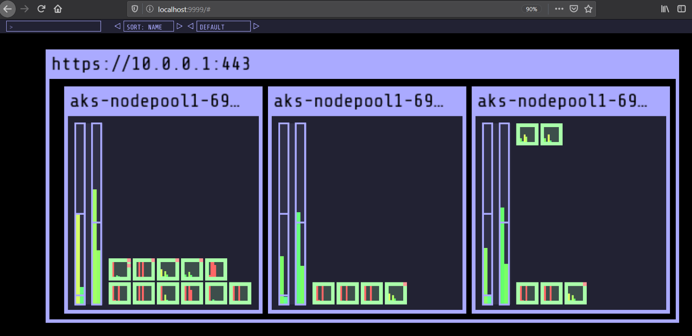

#### Imagine that you have simple three nodes cluster
```console
kubectl get nodes
```
<pre>
NAME                       STATUS   ROLES   AGE    VERSION
aks-nodepool1-69931308-0   Ready    agent   4m8s   v1.17.0
aks-nodepool1-69931308-1   Ready    agent   4m2s   v1.17.0
aks-nodepool1-69931308-2   Ready    agent   4m     v1.17.0
</pre>


Let's  apply our deployment.


At the beginning let's create monitoring namespace

```console
kubectl create namespace monitoring
```

<pre>
namespace/monitoring created
</pre>

Deploy visualisation application in monitoring namespace
```console
kubectl apply -f ./kube-web-view/ -n monitoring
```
<pre>
serviceaccount/kube-ops-view created
clusterrole.rbac.authorization.k8s.io/kube-ops-view created
clusterrolebinding.rbac.authorization.k8s.io/kube-ops-view created
deployment.apps/kube-ops-view created
deployment.apps/kube-ops-view-redis created
service/kube-ops-view-redis created
service/kube-ops-view created
</pre>

```console
kubectl get svc -n monitoring
```
<pre>
kube-ops-view         ClusterIP   10.0.184.228   <none>        8080/TCP   82s
kube-ops-view-redis   ClusterIP   10.0.176.174   <none>        6379/TCP   82s
</pre>


Forward port from kubectl-ops-view service to localhost on port 9999

```console
kubectl port-forward -n monitoring svc/kube-ops-view 9999:8080
```
<pre>
Forwarding from 127.0.0.1:9999 -> 8080
Forwarding from [::1]:9999 -> 8080
</pre>


Browse at http://localhost:9999

No we can see distribution of pods across our cluster worker nodes.



```console
kubectl get pods --all-namespaces
```
<pre>
NAMESPACE     NAME                                                  READY   STATUS    RESTARTS   AGE
kube-system   calico-node-9g8nq                                     1/1     Running   0          19m
kube-system   calico-node-bhd9x                                     1/1     Running   0          19m
kube-system   calico-node-q69r7                                     1/1     Running   0          19m
kube-system   calico-typha-d6859cccb-f7twx                          1/1     Running   0          22m
kube-system   calico-typha-horizontal-autoscaler-6fd8df4754-bjjv6   1/1     Running   0          22m
kube-system   coredns-544d979687-5fzfn                              1/1     Running   0          22m
kube-system   coredns-autoscaler-546d886ffc-wm8fk                   1/1     Running   0          22m
kube-system   dashboard-metrics-scraper-867cf6588-qxrg9             1/1     Running   0          22m
kube-system   kube-proxy-2958q                                      1/1     Running   0          19m
kube-system   kube-proxy-4tn5j                                      1/1     Running   0          19m
kube-system   kube-proxy-k7cpg                                      1/1     Running   0          19m
kube-system   kubernetes-dashboard-7f7676f7b5-gzbsc                 1/1     Running   2          22m
kube-system   metrics-server-75b8b88d6b-6c47p                       1/1     Running   1          22m
kube-system   omsagent-b62qb                                        1/1     Running   1          19m
kube-system   omsagent-rhbsr                                        1/1     Running   1          19m
kube-system   omsagent-rs-6f8dc9d4bc-7725g                          1/1     Running   1          22m
kube-system   omsagent-s65rj                                        1/1     Running   1          19m
kube-system   tunnelfront-85c4df9977-2v7xc                          1/1     Running   0          22m
monitoring    kube-ops-view-7b47c5594d-j5dlf                        1/1     Running   0          2m28s
monitoring    kube-ops-view-redis-7b7b586cf4-h6npb                  1/1     Running   0          2m28s
</pre>


What is the utilisation of our nodes at the moment

```console
kubectl top nodes
```
<pre>
aks-nodepool1-69931308-0   205m         10%    1182Mi          55%       
aks-nodepool1-69931308-1   90m          4%     842Mi           39%       
aks-nodepool1-69931308-2   103m         5%     881Mi           41%  
</pre>

```
kubectl get nodes -o json |jq ".items[] | {name:.metadata.name} + .status.capacity"
```
```json
{
  "name": "aks-nodepool1-69931308-0",  
  "attachable-volumes-azure-disk": "4",
  "cpu": "2",
  "ephemeral-storage": "101445900Ki",
  "hugepages-1Gi": "0",
  "hugepages-2Mi": "0",
  "memory": "4017260Ki",
  "pods": "30"
}
{
  "name": "aks-nodepool1-69931308-1",
  "attachable-volumes-azure-disk": "4",
  "cpu": "2",
  "ephemeral-storage": "101445900Ki",
  "hugepages-1Gi": "0",
  "hugepages-2Mi": "0",
  "memory": "4017260Ki",
  "pods": "30"
}
{
  "name": "aks-nodepool1-69931308-2",
  "attachable-volumes-azure-disk": "4",
  "cpu": "2",
  "ephemeral-storage": "101445900Ki",
  "hugepages-1Gi": "0",
  "hugepages-2Mi": "0",
  "memory": "4017260Ki",
  "pods": "30"
}
```


Create new namespace for failure tests.

```console
kubectl create namespace failure
```

<pre>
namespace/failure created
</pre>

Change our connected namespace to failure 

```console
kubectl config set-context --current --namespace=failure
```
<pre>
Context "***" modified.
</pre>

Set limit on namespace failure

Create ResourceQuota
```console
kubectl apply -f quotas.yaml
```
<pre>
resourcequota/compute-resources created
</pre>

```console
kubectl describe resourcequota
```

<pre>
Name:                    compute-resources
Namespace:               failure
Resource                 Used  Hard
--------                 ----  ----
limits.cpu               0     4
limits.memory            0     8Gi
pods                     0     50
requests.cpu             0     2
requests.memory          0     4Gi
requests.nvidia.com/gpu  0     0
</pre>

Lets add limit per memory and cpu for every container in failure namespace 

```console
kubectl apply -f limit-mem-cpu-container.yaml
```
<pre> 
limitrange/limit-mem-cpu-per-container created
</pre>

```console
kubectl describe ns failure
```
<pre>
Name:         failure
Labels:       <none>
Annotations:  <none>
Status:       Active

Resource Quotas
 Name:                    compute-resources
 Resource                 Used  Hard
 --------                 ---   ---
 limits.cpu               0     4
 limits.memory            0     8Gi
 pods                     0     50
 requests.cpu             0     2
 requests.memory          0     4Gi
 requests.nvidia.com/gpu  0     0

Resource Limits
 Type       Resource  Min   Max    Default Request  Default Limit  Max Limit/Request Ratio
 ----       --------  ---   ---    ---------------  -------------  -----------------------
 Container  memory    10Mi  200Gi  20Mi             50Mi           -
 Container  cpu       10m   200m   20m              50m            -
</pre>


Let deploy two applications


Wordsmith (three different pods) and Php-hello (one different pod)

Wordsmith

```console
kubectl apply -f ./wordsmith -n failure
```
<pre>
deployment.apps/words created
service/words created
deployment.apps/db created
service/db created
deployment.apps/web created
service/web created
</pre>


Php-hello

```console
kubectl apply -f php-info/
```
<pre>
deployment.apps/php-hello created
service/php-hello created
</pre>


Let's see Qualit of Service Class for every pod

```console
kubectl get  pod -o json |jq ".items[] | .metadata.name+ .status.qosClass"
```
<pre>
"db-55c54d99dc-4skgrBurstable"
"db-55c54d99dc-dvhkxBurstable"
"db-55c54d99dc-m6hp7Burstable"
"db-55c54d99dc-srfx5Burstable"
"php-hello-545cb7449b-98hvmGuaranteed"
"php-hello-545cb7449b-cmhqrGuaranteed"
"php-hello-545cb7449b-ktxp8Guaranteed"
"php-hello-545cb7449b-kxsxsGuaranteed"
"php-hello-545cb7449b-l4s98Guaranteed"
"php-hello-545cb7449b-p9xcxGuaranteed"
"php-hello-545cb7449b-r2jv9Guaranteed"
"php-hello-545cb7449b-s2hwtGuaranteed"
"php-hello-545cb7449b-svggkGuaranteed"
"php-hello-545cb7449b-tb62nGuaranteed"
"web-7c45c79fcb-2mlw8Guaranteed"
"web-7c45c79fcb-blzqzGuaranteed"
"web-7c45c79fcb-bmbgkGuaranteed"
"web-7c45c79fcb-jl95nGuaranteed"
"web-7c45c79fcb-jsrrxGuaranteed"
"words-7f9bc66685-26j6cBurstable"
"words-7f9bc66685-4bxcxBurstable"
"words-7f9bc66685-5whjkBurstable"
"words-7f9bc66685-6fgpfBurstable"
"words-7f9bc66685-8qq8zBurstable"
"words-7f9bc66685-9755cBurstable"
"words-7f9bc66685-9h6btBurstable"
"words-7f9bc66685-bkrpnBurstable"
"words-7f9bc66685-bq5nwBurstable"
"words-7f9bc66685-c72m7Burstable"
"words-7f9bc66685-j9865Burstable"
"words-7f9bc66685-jzxmlBurstable"
"words-7f9bc66685-mpn2rBurstable"
"words-7f9bc66685-mrbmzBurstable"
"words-7f9bc66685-ps47qBurstable"
"words-7f9bc66685-sb76lBurstable"
"words-7f9bc66685-sqqf9Burstable"
"words-7f9bc66685-swzfxBurstable"
"words-7f9bc66685-vcdr9Burstable"
"words-7f9bc66685-wwswcBurstable"
</pre>
END TODO


Literature:


https://medium.com/google-cloud/fine-tuning-a-kubernetes-cluster-187d79370fd9

https://fatalfailure.wordpress.com/2016/06/10/improving-kubernetes-reliability-quicker-detection-of-a-node-down/

https://www.replex.io/blog/everything-you-need-to-know-about-kubernetes-quality-of-service-qos-classes


```console
kubectl get all -n failure
```

<pre>

</pre>

Now we would like to know on what nodes are deployed our pods

Let's try with filtering our pods in dedicated failure namespace

```console
kubectl get pods -l app=my-failure-app -n failure
```
<pre>
NAME                              READY   STATUS    RESTARTS   AGE
my-failure-app-5b784b5746-2nsmd   1/1     Running   0          3m25s
my-failure-app-5b784b5746-sm2qm   1/1     Running   0          3m25s
</pre>

```console
kubectl get pods -l app=my-failure-app -n failure -o wide
```
<pre>
NAME                              READY   STATUS    RESTARTS   AGE     IP            NODE                       NOMINATED NODE   READINESS GATES
my-failure-app-5b784b5746-2nsmd   1/1     Running   0          5m33s   10.244.1.52   aks-nodepool1-16191604-0   <none>
        <none>
my-failure-app-5b784b5746-sm2qm   1/1     Running   0          5m33s   10.244.1.51   aks-nodepool1-16191604-0   <none>
        <none>
</pre>

Here I have both pods on the same node. Let's shutdown the node-0.
Stop the corresponding VM aks-nodepool1-16191604-0.
<pre>
Stopping virtual machine 'aks-nodepool1-16191604-0'...
...

</pre>

After few minutes

```console
kubectl get nodes
```

<pre>
NAME                       STATUS     ROLES   AGE   VERSION
aks-nodepool1-16191604-0   NotReady   agent   32d   v1.14.5
aks-nodepool1-16191604-1   Ready      agent   32d   v1.14.5
</pre>

```console
kubectl get pods -l app=my-failure-app -n failure -o wide
```

<pre>
NAME                              READY   STATUS    RESTARTS   AGE   IP            NODE                       NOMINATED NODE   READINESS GATES
my-failure-app-5b784b5746-2nsmd   1/1     Running   0          14m   10.244.1.52   aks-nodepool1-16191604-0   <none>           <none>
my-failure-app-5b784b5746-sm2qm   1/1     Running   0          14m   10.244.1.51   aks-nodepool1-16191604-0   <none>           <none>
</pre>

Kubernetes still doesnt know that pods node aks-nodepool1-16191604-0 are out of service

After few minutes
<pre>
NAME                              READY   STATUS        RESTARTS   AGE   IP            NODE                       NOMINATED NODE   READINESS GATES
my-failure-app-5b784b5746-2nsmd   1/1     Terminating   0          17m   10.244.1.52   aks-nodepool1-16191604-0   <none>           <none>
my-failure-app-5b784b5746-7jrdw   1/1     Running       0          46s   10.244.0.53   aks-nodepool1-16191604-1   <none>           <none>
my-failure-app-5b784b5746-sm2qm   1/1     Terminating   0          17m   10.244.1.51   aks-nodepool1-16191604-0   <none>           <none>
my-failure-app-5b784b5746-twc45   1/1     Running       0          46s   10.244.0.52   aks-nodepool1-16191604-1   <none>           <none>
</pre>

Look at new running pods on ks-nodepool1-16191604-1 node.

The old instances on node aks-nodepool1-16191604-0 are  terminating .... terminating ... forever. Why ?


Now turn on aks-nodepool1-16191604-0 VM.
<pre>
Starting virtual machine 'aks-nodepool1-16191604-0'...
</pre>

```console
kubectl get nodes
```

<pre>
NAME                       STATUS   ROLES   AGE   VERSION
aks-nodepool1-16191604-0   Ready    agent   32d   v1.14.5
aks-nodepool1-16191604-1   Ready    agent   32d   v1.14.5
</pre>

```console
kubectl get pods -l app=my-failure-app -n failure -o wide
```

<pre>
NAME                              READY   STATUS    RESTARTS   AGE     IP            NODE                       NOMINATED NODE   READINESS GATES
my-failure-app-5b784b5746-7jrdw   1/1     Running   0          7m37s   10.244.0.53   aks-nodepool1-16191604-1   <none>           <none>
my-failure-app-5b784b5746-twc45   1/1     Running   0          7m37s   10.244.0.52   aks-nodepool1-16191604-1   <none>           <none>
</pre>

Our terminating pods are missing, Why ?

Literature:
https://medium.com/google-cloud/fine-tuning-a-kubernetes-cluster-187d79370fd9

https://fatalfailure.wordpress.com/2016/06/10/improving-kubernetes-reliability-quicker-detection-of-a-node-down/


Create cluster with tree nodes

```console
kubectl get nodes 
```
<pre>
NAME                       STATUS   ROLES   AGE     VERSION
aks-nodepool1-36820653-0   Ready    agent   6d23h   v1.17.0
aks-nodepool1-36820653-1   Ready    agent   6d23h   v1.17.0
aks-nodepool1-36820653-2   Ready    agent   9m18s   v1.17.0
</pre>

```console
kubectl top nodes
```
<pre>
aks-nodepool1-36820653-0   207m         10%    1149Mi          53%       
aks-nodepool1-36820653-1   105m         5%     918Mi           42%
aks-nodepool1-36820653-2   88m          4%     893Mi           41%
</pre>

```
kubectl get nodes -o json |jq ".items[] | {name:.metadata.name} + .status.capacity"
```
```json
{
  "name": "aks-nodepool1-36820653-0",
  "attachable-volumes-azure-disk": "4",
  "cpu": "2",
  "ephemeral-storage": "101445900Ki",
  "hugepages-1Gi": "0",
  "hugepages-2Mi": "0",
  "memory": "4017572Ki",
  "pods": "30"
}
{
  "name": "aks-nodepool1-36820653-1",
  "attachable-volumes-azure-disk": "4",
  "cpu": "2",
  "ephemeral-storage": "101445900Ki",
  "hugepages-1Gi": "0",
  "hugepages-2Mi": "0",
  "memory": "4017572Ki",
  "pods": "30"
}
{
  "name": "aks-nodepool1-36820653-2",
  "attachable-volumes-azure-disk": "4",
  "cpu": "2",
  "ephemeral-storage": "101445900Ki",
  "hugepages-1Gi": "0",
  "hugepages-2Mi": "0",
  "memory": "4017260Ki",
  "pods": "30"
}
```

```console
kubectl top pods --all-namespaces
```
<pre>
NAMESPACE     NAME                                                  CPU(cores)   MEMORY(bytes)   
kube-system   calico-node-52rdb                                     19m          18Mi
kube-system   calico-node-lzpvf                                     17m          48Mi
kube-system   calico-node-tnjzz                                     17m          44Mi
kube-system   calico-typha-7d6f9f5d9d-trtrp                         4m           19Mi
kube-system   calico-typha-horizontal-autoscaler-6fd8df4754-9j2kk   1m           7Mi
kube-system   coredns-6c9b65c6cd-fwtlw                              3m           10Mi
kube-system   coredns-autoscaler-546d886ffc-8m5rn                   1m           7Mi
kube-system   dashboard-metrics-scraper-867cf6588-wkwhl             1m           9Mi
kube-system   kube-proxy-7dhkv                                      1m           16Mi
kube-system   kube-proxy-jhg25                                      1m           15Mi
kube-system   kube-proxy-km8hl                                      1m           16Mi
kube-system   kubernetes-dashboard-7f7676f7b5-m2n25                 1m           13Mi
kube-system   metrics-server-75b8b88d6b-pxpv8                       1m           12Mi
kube-system   omsagent-58fcb                                        4m           82Mi
kube-system   omsagent-gvddg                                        7m           76Mi
kube-system   omsagent-rs-59565d87d7-smbvd                          6m           81Mi
kube-system   omsagent-zsr7d                                        6m           78Mi
kube-system   tunnelfront-588bf4cb9d-sgp7f                          82m          8Mi
</pre>


Create namespace failure

```
kubectl create ns failure
```
<pre>
namespace/failure created
</pre>
```
kubectl config set-context --current --namespace=failure
```
<pre>
Context "***" modified.
</pre>

set limit on namespace

Create ResourceQuota
```console
kubectl apply -f quotas.yaml
```
<pre>
resourcequota/compute-resources created
</pre>

```
kubectl describe resourcequota
```
<pre>
Name:                    compute-resources
Namespace:               failure
Resource                 Used   Hard      
--------                 ----   ----      
limits.cpu               400m   4
limits.memory            200Mi  4Gi       
pods                     2      40        
requests.cpu             100m   2
requests.memory          100Mi  2Gi       
requests.nvidia.com/gpu  0      0
</pre>
```
kubectl apply -f limit-mem-cpu-container.yaml
```
<pre> 
limitrange/limit-mem-cpu-per-container created
</pre>
```console
kubectl describe ns failure
```
<pre>
Name:         failure
Labels:       <none>
Annotations:  <none>
Status:       Active

Resource Quotas
 Name:                    compute-resources
 Resource                 Used    Hard
 --------                 ---     ---
 limits.cpu               2400m   4
 limits.memory            1200Mi  4Gi
 pods                     22      40
 requests.cpu             1100m   2
 requests.memory          500Mi   2Gi
 requests.nvidia.com/gpu  0       0

Resource Limits
 Type       Resource  Min   Max    Default Request  Default Limit  Max Limit/Request Ratio
 ----       --------  ---   ---    ---------------  -------------  -----------------------
 Container  cpu       50m   200m   50m              100m           -
 Container  memory    50Mi  200Gi  50Mi             100Mi          -
</pre>


Install  kube-ops-view 

```console
kubectl apply -f kube-web-view -n failure
```
<pre>
serviceaccount/kube-ops-view created
clusterrole.rbac.authorization.k8s.io/kube-ops-view created
clusterrolebinding.rbac.authorization.k8s.io/kube-ops-view created
deployment.apps/kube-ops-view created
deployment.apps/kube-ops-view-redis created
service/kube-ops-view-redis created
service/kube-ops-view created
</pre>

kubectl get pods -l application=kube-ops-view


kubectl port-forward svc/kube-ops-view 8080:8080
Forwarding from 127.0.0.1:8080 -> 8080
Forwarding from [::1]:8080 -> 8080

Browse at:


http://localhost:8080


Let deploy two applications


Wordsmith (three different pods) and Php-hello (one dirrefent pod)


kubectl apply -f php-hello-deployment.yaml


