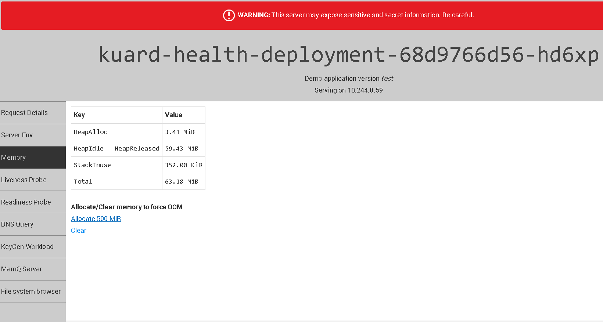
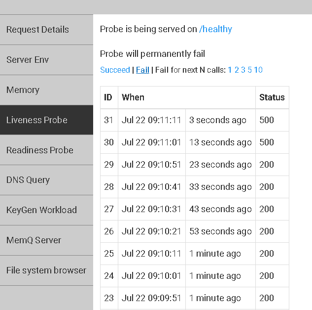

Types of health checks
Kubernetes gives you two types of health checks, and it is important to understand the differences between the two, and their uses.
Readiness


Readiness probes are designed to let Kubernetes know when your app is ready to serve traffic. Kubernetes makes sure the readiness probe passes before allowing a service to send traffic to the pod. If a readiness probe starts to fail, Kubernetes stops sending traffic to the pod until it passes.
Liveness
Liveness probes let Kubernetes know if your app is alive or dead. If you app is alive, then Kubernetes leaves it alone. If your app is dead, Kubernetes removes the Pod and starts a new one to replace it.


Type of Probes
The next step is to define the probes that test readiness and liveness. There are three types of probes: HTTP, Command, and TCP. You can use any of them for liveness and readiness checks.
HTTP
HTTP probes are probably the most common type of custom liveness probe. Even if your app isn’t an HTTP server, you can create a lightweight HTTP server inside your app to respond to the liveness probe. Kubernetes pings a path, and if it gets an HTTP response in the 200 or 300 range, it marks the app as healthy. Otherwise it is marked as unhealthy.
You can read more about HTTP probes here.
Command
For command probes, Kubernetes runs a command inside your container. If the command returns with exit code 0, then the container is marked as healthy. Otherwise, it is marked unhealthy. This type of probe is useful when you can’t or don’t want to run an HTTP server, but can run a command that can check whether or not your app is healthy.

You can read more about command probes here.
TCP
The last type of probe is the TCP probe, where Kubernetes tries to establish a TCP connection on the specified port. If it can establish a connection, the container is considered healthy; if it can’t it is considered unhealthy.

TCP probes come in handy if you have a scenario where HTTP probes or command probe don’t work well. For example, a gRPC or FTP service is a prime candidate for this type of probe.

You can read more about TCP probes here.


```console
kubectl apply -f kuard-deploy-heath-check.yaml
```

```console
kubectl get all --namespace=default
```
<pre>
NAME                                           READY   STATUS    RESTARTS   AGE
pod/kuard-health-deployment-68d9766d56-hd6xp   1/1     Running   0          11m
pod/kuard-health-deployment-68d9766d56-kqhjh   1/1     Running   0          11m

NAME                   TYPE        CLUSTER-IP    EXTERNAL-IP   PORT(S)          AGE
service/kuard-health   NodePort    10.0.53.91    <none>        8080:31324/TCP   11m

NAME                                      READY   UP-TO-DATE   AVAILABLE   AGE
deployment.apps/kuard-health-deployment   2/2     2            2           11m

NAME                                                 DESIRED   CURRENT   READY   AGE
replicaset.apps/kuard-health-deployment-68d9766d56   2         2         2       11m
</pre>

```console
kubectl port-forward deploy/kuard-health-deployment 8080:8080
```
<pre>
Forwarding from 127.0.0.1:8080 -> 8080
Forwarding from [::1]:8080 -> 8080
Handling connection for 8080
Handling connection for 8080
</pre>


#### Trying to allocate memory and putting liveness to status 500
```console
kubectl get all --namespace=default
```
<pre>
NAME                                           READY   STATUS    RESTARTS   AGE
pod/kuard-health-deployment-68d9766d56-hd6xp   1/1     Running   2          13m
pod/kuard-health-deployment-68d9766d56-kqhjh   1/1     Running   3          13m

NAME                   TYPE        CLUSTER-IP    EXTERNAL-IP   PORT(S)          AGE
service/kuard-health   NodePort    10.0.53.91    <none>        8080:31324/TCP   13m


NAME                                      READY   UP-TO-DATE   AVAILABLE   AGE
deployment.apps/kuard-health-deployment   2/2     2            2           13m

NAME                                                 DESIRED   CURRENT   READY   AGE
replicaset.apps/kuard-health-deployment-68d9766d56   2         2         2       13m

</pre>







## Resources reqests and limits


**requests.cpu** is the maximum combined CPU requests in millicores for all the containers in the Namespace. In the above example, you can have 50 containers with 10m requests, five containers with 100m requests, or even one container with a 500m request. As long as the total requested CPU in the Namespace is less than 500m!

**requests.memory** is the maximum combined Memory requests for all the containers in the Namespace. In the above example, you can have 50 containers with 2MiB requests, five containers with 20MiB CPU requests, or even a single container with a 100MiB request. As long as the total requested Memory in the Namespace is less than 100MiB!

**limits.cpu** is the maximum combined CPU limits for all the containers in the Namespace. It’s just like requests.cpu but for the limit.

**limits.memory** is the maximum combined Memory limits for all containers in the Namespace. It’s just like requests.memory but for the limit.

```console
kubectl describe nodes |grep "Allocated resources:" -A7
```
<pre>
Allocated resources:
  (Total limits may be over 100 percent, i.e., overcommitted.)
  Resource                       Requests      Limits
  --------                       --------      ------
  cpu                            1155m (59%)   900m (46%)
  memory                         1296Mi (60%)  2170Mi (101%)
  ephemeral-storage              0 (0%)        0 (0%)
  attachable-volumes-azure-disk  0             0
</pre>

### Creating new namespace
```console
kubectl create namespace my-app
```
<pre>
cat <<EOF > quotas.yaml
apiVersion: v1
kind: ResourceQuota
metadata:
  name: compute-resources
spec:
  hard:
    pods: "20"
    requests.cpu: "2"
    requests.memory: 2Gi
    limits.cpu: "4"
    limits.memory: 4Gi
    requests.nvidia.com/gpu: 4
EOF
</pre>

### Applying quotas to namespace
```console
kubectl apply -f ./quotas.yaml --namespace=my-app
```


Based on 
https://cloud.google.com/blog/products/gcp/kubernetes-best-practices-setting-up-health-checks-with-readiness-and-liveness-probes

https://cloud.google.com/blog/products/gcp/kubernetes-best-practices-resource-requests-and-limits

https://github.com/kubernetes-up-and-running
