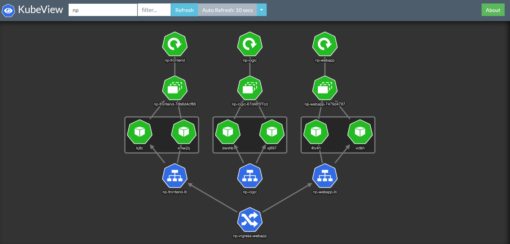

## Testing in play with docker sandbox

### Run logic	
```console
docker run -d -p 5000:5000 --name np-logic  djkormo/np-logic
```

#### testing from curl

```console
curl http://localhost:5000/analyse/sentiment -X POST --header "Content-Type: application/json"  -d '{"sentence": "I love to drink beer"}'

curl http://localhost:5000/analyse/sentiment -X POST --header "Content-Type: application/json"  -d '{"sentence": "I hate my life"}'

docker inspect -f '{{range .NetworkSettings.Networks}}{{.IPAddress}}{{end}}' np-logic

```

#### run webapp

```console

NP_LOGIC_IP=$(docker inspect -f '{{range .NetworkSettings.Networks}}{{.IPAddress}}{{end}}' np-logic );
echo $NP_LOGIC_IP

docker run -d -p 8080:8080 -e SA_LOGIC_API_URL="http://$NP_LOGIC_IP:5000" \
--name np-webapp djkormo/np-webapp	
```


docker inspect -f '{{range .NetworkSettings.Networks}}{{.IPAddress}}{{end}}' np-webapp


##### testing from curl

```console
curl http://localhost:8080/sentiment/ -X POST  --header "Content-Type: application/json"  -d '{"sentence": "I love yogobella"}'

curl http://localhost:8080/sentiment/ -X POST  --header "Content-Type: application/json"  -d '{"sentence": "I hate my mother"}'
```

#### run frontend 
```console
docker inspect -f '{{range .NetworkSettings.Networks}}{{.IPAddress}}{{end}}' np-webapp


NP_WEBAPP_IP=$(docker inspect -f '{{range .NetworkSettings.Networks}}{{.IPAddress}}{{end}}' np-webapp );
echo $NP_WEBAPP_IP

docker run -d -p 80:80  -e SA_WEBAPP_API_URL="http://$NP_WEBAPP_IP:8080/sentiment/" --name np-frontend djkormo/np-frontend
``` 

-----------------------------------------------------------------
## Running in Kubernetes cluster

```console
kubectl apply -f np-logic-deployment.yaml 
```
<pre>
deployment.extensions/np-logic created
</pre>
```console
kubectl apply -f np-logic-service.yaml 
```
<pre>
service/np-logic created
</pre>

#### Lets try our first part of application
```console
kubectl run app-tester --generator=run-pod/v1 \
  --limits="cpu=200m,memory=100Mi" \
  --requests="cpu=100m,memory=50Mi" \
  --rm -i --tty --image radial/busyboxplus:curl -- sh
```
<pre>
If you don't see a command prompt, try pressing enter.
</pre>
##### Put inside the pod

```console
curl http://np-logic/analyse/sentiment -X POST --header "Content-Type: application/json"  -d '{"sentence": "I hate my life"}'
```
<pre>
{
  "polarity": -0.8, 
  "sentence": "I hate my life"
}
</pre>
```console
curl http://np-logic/analyse/sentiment -X POST --header "Content-Type: application/json"  -d '{"sentence": "I love cats and dogs"}'
```
<pre>

{
  "polarity": 0.5,
  "sentence": "I love cats and dogs"
}
</pre>

exit and remove the 
```console
exit
```
<pre>
Session ended, resume using 'kubectl attach app-tester -c app-tester -i -t' command when the pod is running
pod "app-tester" deleted
</pre>

```console
kubectl apply -f np-webapp-deployment.yaml 
```
<pre>
deployment.extensions/np-webapp created
</pre>

```console
kubectl apply -f np-webapp-service-lb.yaml 
```
<pre>
service/np-webapp-lb created
</pre>

#### Lets try our second part of application
```console
kubectl run app-tester --generator=run-pod/v1 \
  --limits="cpu=200m,memory=100Mi" \
  --requests="cpu=100m,memory=50Mi" \
  --rm -i --tty --image radial/busyboxplus:curl -- sh
```

<pre>
If you don't see a command prompt, try pressing enter.
</pre>

```console
curl http://np-webapp-lb:80/sentiment/ -X POST  --header "Content-Type: application/json"  -d '{"sentence": "I love yogobella"}'
```
<pre>
{"sentence":"I love yogobella","polarity":0.5}
</pre>

```console
curl http://np-webapp-lb:80/sentiment/ -X POST  --header "Content-Type: application/json"  -d '{"sentence": "I hate lazy people"}'
```
<pre>
{"sentence":"I hate lazy people","polarity":-0.525}
</pre>


```console
exit
```
<pre>
Session ended, resume using 'kubectl attach app-tester -c app-tester -i -t' command when the pod is running
pod "app-tester" deleted
</pre>


```console
kubectl apply -f np-frontend-deployment.yaml
```
<pre> 
deployment.extensions/np-frontend created
</pre>

```console
kubectl apply -f np-frontend-service-lb.yaml
```
<pre>
service/np-frontend-lb created
</pre>
```console
kubectl get svc,ingress
```
<pre>
NAME                     TYPE           CLUSTER-IP      EXTERNAL-IP   PORT(S)          AGE
service/np-frontend-lb   LoadBalancer   10.110.99.162   localhost     9999:30090/TCP   13h
service/np-logic         ClusterIP      10.102.87.48    <none>        80/TCP           14h
service/np-webapp-lb     ClusterIP      10.101.49.112   <none>        80/TCP           13h

NAME                                   HOSTS   ADDRESS   PORTS   AGE
ingress.extensions/np-ingress-webapp   *                 80      88m
</pre>


```console
kubectl top pods
```
<pre>

NAME                           CPU(cores)   MEMORY(bytes)   
np-frontend-7db6d4cf86-kjltc   1m           12Mi
np-frontend-7db6d4cf86-xmw2q   1m           12Mi
np-logic-67d485f7cd-dwxhb      1m           44Mi
np-logic-67d485f7cd-xj697      1m           41Mi
np-webapp-7479d4787-4tv4h      2m           136Mi
np-webapp-7479d4787-vctkh      2m           164Mi

</pre>

Visualisation of the final step




Literature:

https://cloudblogs.microsoft.com/opensource/2019/10/17/tutorial-calico-network-policies-with-azure-kubernetes-service/


