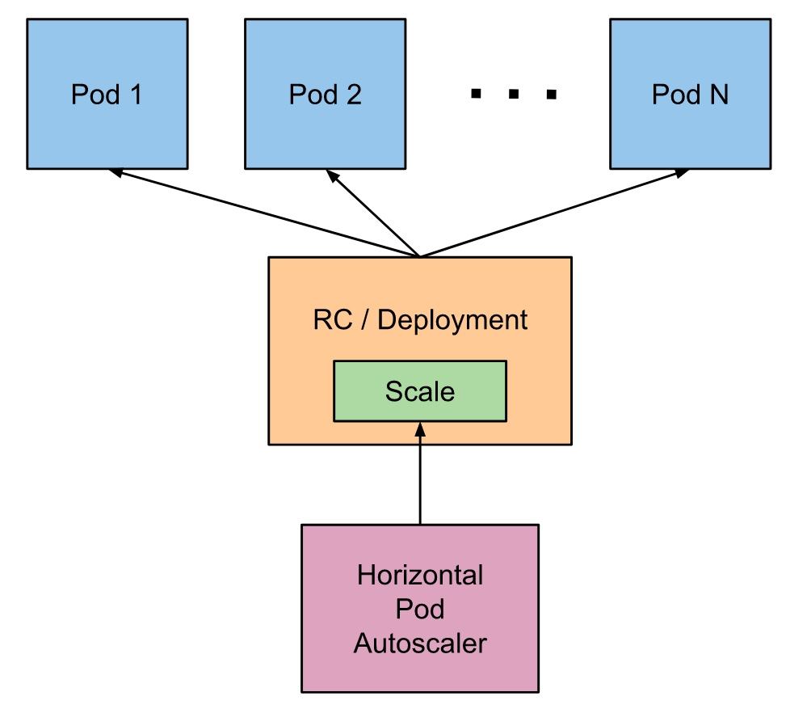

### Scaling pods
```console
kubectl create ns scaling
```

<pre>
namespace/scaling created
</pre>

#### Lets switch connection context to a new namespace (scaling)
```console
kubectl config set-context --current --namespace=scaling
```
<pre>
Context "***" modified.
</pre>

### Create pods 
```console
kubectl apply -f apache-php-api-deployment.yaml
```
<pre>
deployment.apps/apache-php-api created
</pre>
### Create service for them
```console
kubectl apply -f apache-php-api-service.yaml
```
<pre>
service/apache-php-api created
</pre>
```console
kubectl get all
```
<pre>
NAME                                 READY   STATUS    RESTARTS   AGE
pod/apache-php-api-f6c45cd64-2vfhp   0/1     Running   0          85s
pod/apache-php-api-f6c45cd64-gp55f   0/1     Running   0          85s
pod/apache-php-api-f6c45cd64-p8v79   0/1     Running   0          85s

NAME                     TYPE           CLUSTER-IP      EXTERNAL-IP   PORT(S)        AGE
service/apache-php-api   LoadBalancer   10.106.237.12   localhost     2020:32590/TCP   103s

NAME                             READY   UP-TO-DATE   AVAILABLE   AGE
deployment.apps/apache-php-api   0/3     3            0           85s

NAME                                       DESIRED   CURRENT   READY   AGE
replicaset.apps/apache-php-api-f6c45cd64   3         3         0       85s
</pre>

Why is ready equals zero a long time ?

A part of  file apache-php-api-deployment.yaml
```yaml
        livenessProbe:
          httpGet:
            path: /health
            port: 80
          initialDelaySeconds: 60
          periodSeconds: 20
        readinessProbe:
          httpGet:
            path: /health
            port: 80
```


After a while 

```console
kubectl get rs
```
<pre>
NAME                       DESIRED   CURRENT   READY   AGE
apache-php-api-f6c45cd64   3         3         3       4m29s
</pre>


### Scale to 5 instances
```console
kubectl scale --replicas=5 deployment/apache-php-api
```
<pre>
deployment.extensions/apache-php-api scaled
</pre>

```console
kubectl get rs,po
```
<pre>
NAME                                             DESIRED   CURRENT   READY   AGE
replicaset.extensions/apache-php-api-f6c45cd64   5         5         5       6m14s

NAME                                 READY   STATUS    RESTARTS   AGE
pod/apache-php-api-f6c45cd64-2vfhp   1/1     Running   0          6m14s
pod/apache-php-api-f6c45cd64-gp55f   1/1     Running   0          6m14s
pod/apache-php-api-f6c45cd64-j7wjk   1/1     Running   0          84s
pod/apache-php-api-f6c45cd64-p8v79   1/1     Running   0          6m14s
pod/apache-php-api-f6c45cd64-wskvn   1/1     Running   0          84s
</pre>


### Autoscaling pods





#### desiredReplicas = ceil[currentReplicas * ( currentMetricValue / desiredMetricValue )]


### Turning on autoscaling based on CPU utilisation

```console
kubectl apply -f apache-php-api-hpa.yaml 
```

<pre>
horizontalpodautoscaler.autoscaling/apache-php-api created
</pre>

```console
kubectl get hpa apache-php-api
```
<pre>
NAME             REFERENCE                   TARGETS   MINPODS   MAXPODS   REPLICAS   AGE
apache-php-api   Deployment/apache-php-api   1%/20%    1         6         5          2m32s
</pre>


```console
kubectl delete hpa/apache-php-api
```
<pre>
horizontalpodautoscaler.autoscaling "apache-php-api" deleted
</pre>

```console
kubectl autoscale deployment apache-php-api --cpu-percent=20 --min=1 --max=10
```

<pre>
horizontalpodautoscaler.autoscaling/apache-php-api autoscaled
</pre>

```console
kubectl get hpa apache-php-api
```

<pre>
NAME             REFERENCE                   TARGETS   MINPODS   MAXPODS   REPLICAS   AGE
apache-php-api   Deployment/apache-php-api   1%/20%    1         10        5          23s
</pre>


```console
kubectl describe hpa apache-php-api
```
<pre>
Name:                                                  apache-php-api
Namespace:                                             scaling
Labels:                                                <none>
Annotations:                                           <none>
CreationTimestamp:                                     Mon, 30 Dec 2019 10:01:58 +0100
Reference:                                             Deployment/apache-php-api
Metrics:                                               ( current / target )
  resource cpu on pods  (as a percentage of request):  1% (1m) / 20%
Min replicas:                                          1
Max replicas:                                          10
Deployment pods:                                       5 current / 5 desired
Conditions:
  Type            Status  Reason               Message
  ----            ------  ------               -------
  AbleToScale     True    ScaleDownStabilized  recent recommendations were higher than current one, applying the highest recent recommendation
  ScalingActive   True    ValidMetricFound     the HPA was able to successfully calculate a replica count from cpu resource utilization (percentage of request)
  ScalingLimited  False   DesiredWithinRange   the desired count is within the acceptable range
Events:           <none>

</pre>


### IF metrics server is absent on  local k8s cluster.

```console
helm repo add stable https://kubernetes-charts.storage.googleapis.com/
helm install metrics stable/metrics-server  --namespace kube-system --set args={--kubelet-insecure-tls}
```


```console
kubectl top nodes
```
<pre>
NAME             CPU(cores)   CPU%   MEMORY(bytes)   MEMORY%   
docker-desktop   324m         16%    2345Mi          60%
</pre>
```console
kubectl top pods
```
<pre>
NAME                              CPU(cores)   MEMORY(bytes)   
apache-php-api-7cbb5654cb-gt964   1m           13Mi
apache-php-api-7cbb5654cb-khmtl   2m           13Mi
apache-php-api-7cbb5654cb-sdl8q   1m           15Mi
apache-php-api-7cbb5654cb-smp8f   1m           14Mi
apache-php-api-7cbb5654cb-txx9j   1m           13Mi
</pre>

#### Lets try to stress our deployment


### 1. Using dedicated  load test 

HPA_SERVICE=apache-php-api:2020

kubectl run --image=djkormo/loadtest loadtest-app \
--generator=run-pod/v1 --restart="Never" \
--image-pull-policy Always \
--env ENDPOINT=http://$HPA_SERVICE \
--env METHOD=GET  \
--env PAYLOAD='{"Test": "test@whitehouse.gov"}' \
--env PHASES=3

### Testing online ...
```console
kubectl logs loadtest-app; kubectl get hpa; kubectl get pod loadtest-app
```

History of pod instances number
```console
kubectl get hpa -w
```
<pre>
NAME             REFERENCE                   TARGETS    MINPODS   MAXPODS   REPLICAS   AGE
apache-php-api   Deployment/apache-php-api   141%/20%   1         10        4          18m
apache-php-api   Deployment/apache-php-api   141%/20%   1         10        8          18m
apache-php-api   Deployment/apache-php-api   150%/20%   1         10        8          18m
apache-php-api   Deployment/apache-php-api   150%/20%   1         10        8          19m
apache-php-api   Deployment/apache-php-api   151%/20%   1         10        10         20m
apache-php-api   Deployment/apache-php-api   1%/20%     1         10        10         20m
apache-php-api   Deployment/apache-php-api   129%/20%   1         10        10         21m
apache-php-api   Deployment/apache-php-api   146%/20%   1         10        10         22m
apache-php-api   Deployment/apache-php-api   129%/20%   1         10        10         23m
apache-php-api   Deployment/apache-php-api   1%/20%     1         10        10         23m
apache-php-api   Deployment/apache-php-api   16%/20%    1         10        10         25m
apache-php-api   Deployment/apache-php-api   31%/20%    1         10        10         26m
apache-php-api   Deployment/apache-php-api   23%/20%    1         10        10         27m
apache-php-api   Deployment/apache-php-api   16%/20%    1         10        10         28m
apache-php-api   Deployment/apache-php-api   1%/20%     1         10        10         29m
apache-php-api   Deployment/apache-php-api   1%/20%     1         10        10         33m
apache-php-api   Deployment/apache-php-api   1%/20%     1         10        8          33m
apache-php-api   Deployment/apache-php-api   1%/20%     1         10        8          34m
apache-php-api   Deployment/apache-php-api   2%/20%     1         10        1          34m
apache-php-api   Deployment/apache-php-api   1%/20%     1         10        1          37m
apache-php-api   Deployment/apache-php-api   2%/20%     1         10        1          38m
</pre>

```console
kubectl logs -f pod/loadtest-app|tail; kubectl get pod/loadtest-app; kubectl get hpa/apache-php-api
```
<pre>
Error distribution:
  [16]  Get http://apache-php-api:2020: dial tcp 10.100.182.13:2020: connect: connection refused
  [1600]        Get http://apache-php-api:2020: net/http: request canceled (Client.Timeout exceeded while awaiting headers)
  [1599]        Get http://apache-php-api:2020: net/http: request canceled while waiting for connection (Client.Timeout exceeded while awaiting headers)

Waiting 15 seconds for the cluster to stabilize
***************************************************************************************
*----------------------------------END LOAD TEST--------------------------------------*
***************************************************************************************
NAME           READY   STATUS      RESTARTS   AGE
loadtest-app   0/1     Completed   0          9m16s
NAME             REFERENCE                   TARGETS   MINPODS   MAXPODS   REPLICAS   AGE
apache-php-api   Deployment/apache-php-api   1%/20%    1         10        8          23m
</pre>

##### Instead of using on time run pod, we can experiment with kubernetes job objects.
###### TODO 


### 2. Using pod inside and wget

```console

kubectl run load-generator --generator=run-pod/v1 \
  --limits="cpu=200m,memory=100Mi" \
  --requests="cpu=100m,memory=50Mi" \
  --rm -i --tty --image busybox -- sh

```

<pre>
while true; do wget -O- http://apache-php-api:2020; done
</pre>
<pre>
Connecting to apache-php-api:2020 (10.100.182.13:2020)
</pre>

Break after 2-3 minutes

```console
exit
```
<pre>
Session ended, resume using 'kubectl attach load-generator -c load-generator -i -t' command when the pod is running 
pod "load-generator" deleted
</pre>


### 3. Using pod inside and curl 

##### Using radial/busyboxplus:curl image instead of busybox (with missing curl)


```console

kubectl run load-generator --generator=run-pod/v1 \
  --limits="cpu=200m,memory=100Mi" \
  --requests="cpu=100m,memory=50Mi" \
  --rm -i --tty --image radial/busyboxplus:curl -- sh

```

<pre>
while true; do curl -v -X Get http://apache-php-api:2020; done
</pre>

<pre>
> Get / HTTP/1.1
> User-Agent: curl/7.35.0
> Host: apache-php-api:2020
> Accept: */*
....
< HTTP/1.1 200 OK
< Date: Mon, 30 Dec 2019 09:34:37 GMT
< Server: Apache/2.4.25 (Debian)
< X-Powered-By: PHP/5.6.40
< Vary: Accept-Encoding
< Content-Length: 73
< Content-Type: text/html; charset=UTF-8
<

Pi ~=: 3.1415936535888 OK! Computed at: apache-php-api-7cbb5654cb-6gkrj> Get / HTTP/1.1
....
Pi ~=: 3.1415936535888 OK! Computed at: apache-php-api-7cbb5654cb-kj458> Get / HTTP/1.1
</pre>

Break after 2-3 minutes

```console
exit
```
<pre>
Session ended, resume using 'kubectl attach load-generator -c load-generator -i -t' command when the pod is running 
pod "load-generator" deleted
</pre>

Literature:

https://kubernetes.io/docs/tasks/run-application/horizontal-pod-autoscale-walkthrough/

https://kubernetes.io/docs/tasks/run-application/horizontal-pod-autoscale/support-for-cooldown-delay

https://github.com/kubernetes-sigs/metrics-server/issues/317

https://aws.amazon.com/premiumsupport/knowledge-center/eks-metrics-server-pod-autoscaler/?nc1=h_ls

https://blog.codewithdan.com/enabling-metrics-server-for-kubernetes-on-docker-desktop/

https://github.com/kubernetes-sigs/metrics-server/issues/167

