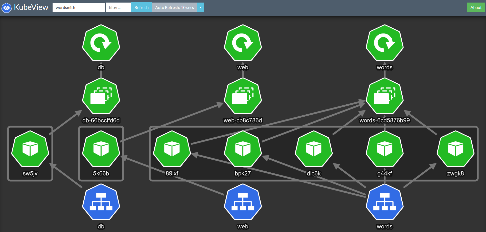
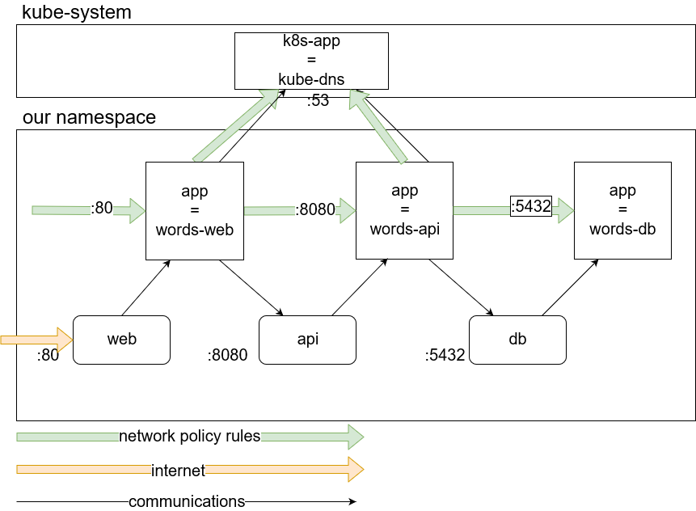

# Kubernetes Wordsmith Demo

Wordsmith is the demo project shown at DockerCon EU 2017, where Docker announced that support for Kubernetes was coming to the Docker platform.

The demo app runs across three containers:

- [db](https://github.com/djkormo/k8s-AKS-primer/tree/master/apps/wordsmith/db/Dockerfile) - a Postgres database which stores words

- [words](https://github.com/djkormo/k8s-AKS-primer/tree/master/apps/wordsmith/words/Dockerfile) - a Java REST API which serves words read from the database

- [web](https://github.com/djkormo/k8s-AKS-primer/tree/master/apps/wordsmith/web/Dockerfile) - a Go web application which calls the API and builds words into sentences:


## Deploy application 

```console
kubectl create ns wordsmith
```
<pre>
namespace/wordsmith created
</pre>

```console
kubectl config  set-context --current --namespace=wordsmith
```
<pre>
Context "***" modified.
</pre>

```console
kubectl get all
```

<pre>
No resources found.
</pre>

### DB part

```console
kubectl apply -f db-service.yaml
```
<pre>
service/db created
</pre>

```console
kubectl apply -f db-deployment-v1.yaml
```
<pre>
deployment.apps/db created
</pre>

### Words part

```console
kubectl apply -f api-service.yaml 
```
<pre>
service/words created
</pre>

```console
kubectl apply -f api-deployment-v1.yaml 
```
<pre>
deployment.apps/words created
</pre>

### Web part

```console
kubectl apply -f web-service.yaml
```
<pre> 
service/web created
</pre>
```console
kubectl apply -f web-deployment-v1.yaml 
```
<pre>
deployment.apps/web created
</pre>

### Deployed services

```console
kubectl get svc
```
in local k8s
<pre>
NAME    TYPE           CLUSTER-IP     EXTERNAL-IP   PORT(S)          AGE  
db      ClusterIP      None           <none>        5432/TCP         3m50s
web     LoadBalancer   10.99.35.213   localhost     8081:31270/TCP   47s  
words   ClusterIP      None           <none>        8080/TCP         2m41s
</pre>
in AKS
<pre>
NAME    TYPE           CLUSTER-IP   EXTERNAL-IP      PORT(S)          AGE
db      ClusterIP      None         <none>           5432/TCP         95s
web     LoadBalancer   10.0.24.18   40.127.224.203   8081:32106/TCP   36s
words   ClusterIP      None         <none>           8080/TCP         78s
</pre>
In kubeview dashboard




Now browse to http://localhost:8081 (or to http://externalIP:8081) and you will see


Let's look ahat we have inside of our namespace





```console
kubectl run curl-$RANDOM --image=radial/busyboxplus:curl --rm -it --generator=run-pod/v1
```

Run inside 
<pre>
curl https://kubernetes.io
curl web:8080
curl words:8080/nouns
curl words:8080/verbs
ping db
telnet db 5432
</pre>

exit
<pre>
Session ended, resume using 'kubectl attach curl-3601 -c curl-3601 -i -t' command when the pod is running        
pod "curl-3601" deleted
</pre>

### Adding network policy for our application 

#### Deny all in namespace
```console
kubectl apply -f np-deny-all.yaml 
```
<pre>
networkpolicy.networking.k8s.io/deny-all created
</pre>

testing connections

```console
kubectl run curl-$RANDOM --image=radial/busyboxplus:curl --rm -it --generator=run-pod/v1
```

<pre>
curl kubernetes.io
curl: (6) Couldn't resolve host 'kubernetes.io'

curl web:8081
curl: (6) Couldn't resolve host 'web'

curl words:8080/nouns
curl: (6) Couldn't resolve host 'words'

ping db
ping: bad address 'db'

telnet db 5432
telnet: bad address 'db'

</pre>

#### Adding rules for db part
```console
kubectl apply -f np-db-allow.yaml 
```
<pre>
networkpolicy.networking.k8s.io/db-netpol created
</pre>

DB (app=words-db) can be only accessed by API part (app=words-api)

testing connections

```console
kubectl run curl-$RANDOM --image=radial/busyboxplus:curl --labels app=words-db --rm -it --generator=run-pod/v1
```
<pre>
url web:8081
curl: (6) Couldn't resolve host 'web'

curl words:8080/nouns
curl: (6) Couldn't resolve host 'words'

</pre>


### Adding  rules for api  part
```console
kubectl apply -f np-api-allow.yaml 
```
<pre>
networkpolicy.networking.k8s.io/api-netpol created
</pre>

Actually, we also need to do an extra action here by adding a Label on the kube-system Namespace (NetworkPolicies are all about Labels):

For right DNS usage


```console
kubectl label ns kube-system name=kube-system
```
<pre>
namespace/kube-system labeled
</pre>

testing connections


```console
kubectl run curl-$RANDOM --image=radial/busyboxplus:curl --labels app=words-api --rm -it --generator=run-pod/v1
```

<pre>
curl kubernetes.io

curl web:8081

telnet db 5432
help me
Connection closed by foreign host
</pre>

### Adding  rules for web  part
```console
kubectl apply -f np-web-allow.yaml 
```
<pre>
networkpolicy.networking.k8s.io/web-netpol created
</pre>


testing connections

```console
kubectl run curl-$RANDOM --image=radial/busyboxplus:curl --labels app=words-web --rm -it  \
  --generator=run-pod/v1
```

<pre>
curl words:8080/noun
{"word":"bicycle"}
curl words:8080/verbs
{"word":"eats"}

</pre>

```console
kubectl get NetworkPolicy
```
<pre>
NAME         POD-SELECTOR   AGE
api-netpol   app=api        12m
db-netpol    app=db         12m
deny-all     <none>         24m
web-netpol   app=web        72s
</pre>

```console
kubectl describe NetworkPolicy deny-all
```
<pre>
Name:         deny-all
Namespace:    wordsmith
Created on:   2020-01-04 18:00:13 +0100 CET
Labels:       <none>
Annotations:  kubectl.kubernetes.io/last-applied-configuration:
                {"apiVersion":"networking.k8s.io/v1","kind":"NetworkPolicy","metadata":{"annotations":{},"name":"deny-all","namespace":"wordsmith"},"spec"...
Spec:
  PodSelector:     <none> (Allowing the specific traffic to all pods in this namespace)
  Allowing ingress traffic:
    <none> (Selected pods are isolated for ingress connectivity)
  Allowing egress traffic:
    <none> (Selected pods are isolated for egress connectivity)
  Policy Types: Ingress, Egress

</pre>


```console
kubectl describe NetworkPolicy web-netpol
```
<pre>
Name:         web-netpol
Namespace:    wordsmith
Created on:   2020-01-04 18:25:22 +0100 CET
Labels:       <none>
Annotations:  kubectl.kubernetes.io/last-applied-configuration:
                {"apiVersion":"networking.k8s.io/v1","kind":"NetworkPolicy","metadata":{"annotations":{},"name":"web-netpol","namespace":"wordsmith"},"spe...
Spec:
  PodSelector:     app=words-web
  Allowing ingress traffic:
    To Port: 80/TCP
    From: <any> (traffic not restricted by source)
  Allowing egress traffic:
    To Port: 8080/TCP
    To:
      PodSelector: app=words-api
    ----------
    To Port: 53/UDP
    To:
      NamespaceSelector: name=kube-system
      PodSelector: k8s-app=kube-dns
  Policy Types: Ingress, Egress
</pre>

```console
kubectl describe NetworkPolicy api-netpol
```
<pre>
Name:         api-netpol
Namespace:    wordsmith
Created on:   2020-01-04 18:17:19 +0100 CET
Labels:       <none>
Annotations:  kubectl.kubernetes.io/last-applied-configuration:
                {"apiVersion":"networking.k8s.io/v1","kind":"NetworkPolicy","metadata":{"annotations":{},"name":"api-netpol","namespace":"wordsmith"},"spe...
Spec:
  PodSelector:     app=words-api
  Allowing ingress traffic:
    To Port: 8080/TCP
    From:
      PodSelector: app=words-web
  Allowing egress traffic:
    To Port: 5432/TCP
    To:
      PodSelector: app=words-db
    ----------
    To Port: 53/UDP
    To:
      NamespaceSelector: name=kube-system
      PodSelector: k8s-app=kube-dns
  Policy Types: Ingress, Egress
</pre>


```console
kubectl describe NetworkPolicy db-netpol
```
<pre>
Name:         db-netpol
Namespace:    wordsmith
Created on:   2020-01-04 18:11:10 +0100 CET
Labels:       <none>
Annotations:  kubectl.kubernetes.io/last-applied-configuration:
                {"apiVersion":"networking.k8s.io/v1","kind":"NetworkPolicy","metadata":{"annotations":{},"name":"db-netpol","namespace":"wordsmith"},"spec...
Spec:
  PodSelector:     app=words-db
  Allowing ingress traffic:
    To Port: 5432/TCP
    From:
      PodSelector: app=words-api
  Allowing egress traffic:
    <none> (Selected pods are isolated for egress connectivity)
  Policy Types: Ingress
</pre>


Based on:
https://github.com/dockersamples/k8s-wordsmith-demo

Literature:
https://medium.com/@nieldw/kubernetes-probes-for-postgresql-pods-a66d707df6b4

https://cloudblogs.microsoft.com/opensource/2019/10/17/tutorial-calico-network-policies-with-azure-kubernetes-service/

https://docs.microsoft.com/en-us/azure/aks/use-network-policies


https://static.sched.com/hosted_files/kccncna17/46/ahmetb%20KubeCon%202017%20NA%20%E2%80%93%20Network%20Policies.pdf


