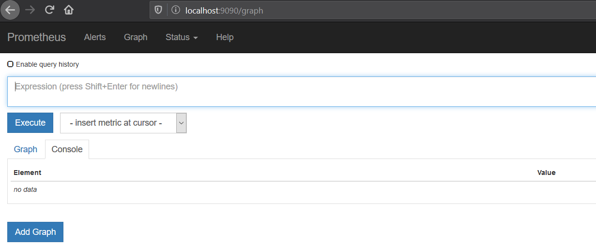

```console
az aks get-credentials --resource-group rg-aks-simple --name aks-simple2020 --overwrite-existing
```

<pre>
az aks get-credentials --resource-group rg-aks-simple --name aks-simple2020 --overwrite-existing
Merged "aks-simple2020" as current context in C:\Users\djkor\.kube\config
</pre>

```console
kubectl config set-context aks-simple2020
```
<pre>
Context "aks-simple2020" modified.
</pre>

```console
kubectl get nodes
```
<pre>
NAME                       STATUS   ROLES   AGE   VERSION
aks-nodepool1-36820653-0   Ready    agent   29m   v1.14.8
aks-nodepool1-36820653-1   Ready    agent   29m   v1.14.8
</pre>

```console
kubectl top nodes
```
<pre>
NAME                       CPU(cores)   CPU%   MEMORY(bytes)   MEMORY%   
aks-nodepool1-36820653-0   42m          2%     314Mi           20%
aks-nodepool1-36820653-1   138m         7%     456Mi           29%       
</pre>

## 1. Using dashboard 
```console
az aks browse --resource-group rg-aks-simple --name aks-simple2020
```

In case of messages like this
<pre>
configmaps is forbidden: User "system:serviceaccount:kube-system:kubernetes-dashboard" cannot list resource "configmaps" in API group "" in the namespace "default"
close
warning
persistentvolumeclaims is forbidden: User "system:serviceaccount:kube-system:kubernetes-dashboard" cannot list resource "persistentvolumeclaims" in API group "" in the namespace "default" 
</pre>

#### Add missing permission for RBAC model
```console
kubectl create -f https://raw.githubusercontent.com/djkormo/ContainersSamples/master/Kubernetes/AKS/kube-dashboard-access.yaml
```
<pre>
clusterrolebinding.rbac.authorization.k8s.io/kubernetes-dashboard created
</pre>

##  2. Adding cluster visualizator (kubeview)  

#### Let's use the kubeview application  in separate namespace (monitor)
```console
kubectl create ns monitor
```
<pre>
namespace/monitor created
</pre>


```console
kubectl apply -f kubeview-deployment.yaml -n monitor

# or directly from github 

kubectl apply -f https://raw.githubusercontent.com/djkormo/k8s-AKS-primer/master/docker/k8s-in-docker-desktop/kubeview-deployment.yaml -n monitor


```
 
<pre>
deployment.extensions/kubeview created
</pre>

```console
kubectl apply -f kubeview-service.yaml -n monitor
```
<pre>
service/kubeview created
</pre>

```console
kubectl get svc -n monitor
```
<pre>
NAME       TYPE        CLUSTER-IP    EXTERNAL-IP   PORT(S)    AGE
kubeview   ClusterIP   10.0.110.83   <none>        3030/TCP   37s
</pre>

## 3. Adding prometheus and grafana

```console
helm install myprometheus  stable/prometheus --version=7.0.0 --namespace=monitor
```

```console
kubectl get svc -n monitor
```
<pre>
NAME                              TYPE        CLUSTER-IP     EXTERNAL-IP   PORT(S)    AGE
kubeview                          ClusterIP   10.0.110.83    <none>        3030/TCP   2m35s
myprometheus-alertmanager         ClusterIP   10.0.138.206   <none>        80/TCP     56s
myprometheus-kube-state-metrics   ClusterIP   None           <none>        80/TCP     56s
myprometheus-node-exporter        ClusterIP   None           <none>        9100/TCP   56s
myprometheus-pushgateway          ClusterIP   10.0.125.156   <none>        9091/TCP   56s
myprometheus-server               ClusterIP   10.0.61.232    <none>        80/TCP     56s
</pre>


```console
kubectl get pod --namespace monitor -l release=myprometheus -l component=server  
```
<pre>
NAME                                   READY   STATUS    RESTARTS   AGE
myprometheus-server-574487798c-s4n7n   2/2     Running   0          5h54m
</pre>


```console
kubectl --namespace monitor port-forward $(kubectl get pod --namespace monitor -l release=myprometheus -l component=server -o template --template "{{(index .items 0).metadata.name}}") 9090:9090
```
<pre>
Forwarding from 127.0.0.1:9090 -> 9090
Forwarding from [::1]:9090 -> 9090
</pre>

Open the browser at:
http://localhost:9090/





```console
helm install mygrafana stable/grafana --namespace=monitor \
    --set=adminUser=admin \
    --set=adminPassword=admin \
    --set=service.type=ClusterIP  \
    --set=service.port=4444 \
    --set grafana\.ini.server.root_url=https://ingress-ops.nd-int-ops-paas.itn/grafana
```

```console
kubectl get pod --namespace monitor  -l release=mygrafana -l app=grafana
```
<pre>
NAME                         READY   STATUS    RESTARTS   AGE
mygrafana-77989f79f9-rw7c5   1/1     Running   0          5h54m
</pre>

```console
kubectl get svc --namespace monitor -l app=grafana
```
<pre>
NAME        TYPE        CLUSTER-IP    EXTERNAL-IP   PORT(S)    AGE
mygrafana   ClusterIP   10.0.84.116   <none>        4444/TCP   5h54m
</pre>

Forwarding service to port 3000

```console
kubectl --namespace monitor port-forward $(kubectl get pod --namespace monitor -l release=mygrafana -l app=grafana -o template --template "{{(index .items 0).metadata.name}}") 3000:3000
```

Open the browser at:
http://localhost:3000/

Use user and password given in  helm chart (admin, admin) and change it ! 

In Grafana add data source, choose Prometheus, in URL put
http://myprometheus-server:80

Why ?

```console
kubectl get svc --namespace monitor -l component=server
```

<pre>
NAME                  TYPE        CLUSTER-IP      EXTERNAL-IP   PORT(S)   AGE
myprometheus-server   ClusterIP   10.0.61.232     <none>        80/TCP     6m34s
</pre>


```console
kubectl get svc -n monitor
```
<pre>
NAME                              TYPE        CLUSTER-IP     EXTERNAL-IP   PORT(S)    AGE
kubeview                          ClusterIP   10.0.110.83    <none>        3030/TCP   8m13s
mygrafana                         ClusterIP   10.0.84.116    <none>        4444/TCP   98s
myprometheus-alertmanager         ClusterIP   10.0.138.206   <none>        80/TCP     6m34s
myprometheus-kube-state-metrics   ClusterIP   None           <none>        80/TCP     6m34s
myprometheus-node-exporter        ClusterIP   None           <none>        9100/TCP   6m34s
myprometheus-pushgateway          ClusterIP   10.0.125.156   <none>        9091/TCP   6m34s
myprometheus-server               ClusterIP   10.0.61.232    <none>        80/TCP     6m34s
</pre>


## 3. Adding ingress

```console 
kubectl create ns ingress
```
<pre>
namespace/ingress created
</pre>

```console
helm install myingress stable/nginx-ingress \
    --namespace ingress \
    --set controller.replicaCount=2 \
    --set controller.nodeSelector."beta\.kubernetes\.io/os"=linux \
    --set defaultBackend.nodeSelector."beta\.kubernetes\.io/os"=linux
```    
<pre>

</pre>

```console
kubectl get service -l app=nginx-ingress --namespace ingress
```
<pre>
NAME                                      TYPE           CLUSTER-IP    EXTERNAL-IP     PORT(S)
   AGE
myingress-nginx-ingress-controller        LoadBalancer   10.0.147.79   40.127.233.36   80:31253/TCP,443:30893/TCP   4h28m
myingress-nginx-ingress-default-backend   ClusterIP      10.0.232.54   <none>          80/TCP
   4h28m
</pre>


Literature:

https://docs.microsoft.com/bs-cyrl-ba/azure/aks/ingress-basic

Rbac for kubeview
https://sre.ink/kubernetes%E9%83%A8%E7%BD%B2kubeview%E9%9B%86%E7%BE%A4%E7%BB%93%E6%9E%84%E9%A2%84%E8%A7%88%E5%B7%A5%E5%85%B7/

Rewriting problems with grafana
https://stackoverflow.com/questions/57170106/trying-to-rewrite-url-for-grafana-with-ingress

https://stackoverflow.com/questions/48410293/kubernetes-ingress-not-adding-the-application-url-for-grafana-dashboard


----- TRASH

### Using ingress to expose kubeview, grafana and prometheus

kubectl apply -f monitor-ingress.yaml -n monitor

<pre>
ingress.extensions/monitor-ingress created
</pre>

```console
kubectl get ingress -n monitor
```
<pre>
NAME              HOSTS   ADDRESS   PORTS   AGE
monitor-ingress   *                 80      24s
</pre>


curl -v -L  http://40.127.233.36/alertmanager/
curl -v -L  http://40.127.233.36/prometheus/
curl -v -L  http://40.127.233.36/grafana/


----- TRASH